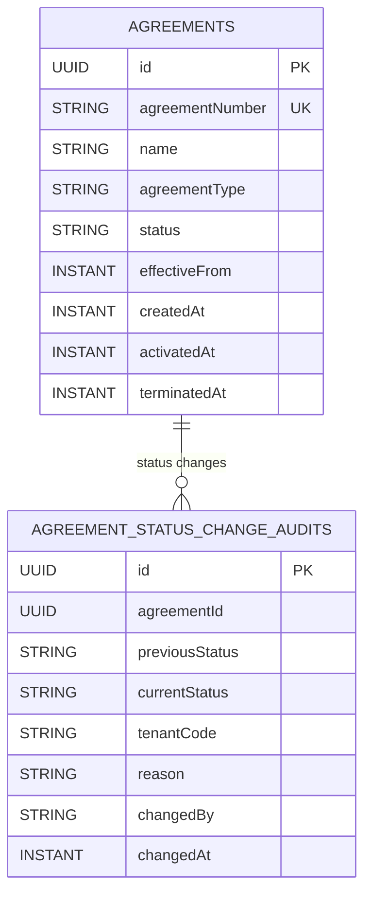

# Agreements Module Data Model (High-Level)

Updated: 2026-03-01

## Entity Diagram

## Relationship Notes

- This initial `agreements` slice models a single aggregate (`Agreement`) with no external entity links.
- `agreementNumber` is the external business identifier and is normalized to uppercase.
- `agreementNumber` is also the direct-read lookup key for `GET /api/agreements/{agreementNumber}`.
- `agreementType` is stored as an uppercase normalized string for consistent filtering/parity expansion.
- `status` starts as `DRAFT` and currently supports transitions:
  - `DRAFT -> ACTIVE`
  - `DRAFT -> TERMINATED`
  - `ACTIVE -> TERMINATED`
  - `TERMINATED` is final (except same-state no-op calls)
- Transition timestamps:
  - `activatedAt` set when agreement transitions to `ACTIVE`
  - `terminatedAt` set when agreement transitions to `TERMINATED`
  - when `ACTIVE -> TERMINATED`, `activatedAt` remains populated and `terminatedAt` is set
- Immutable status history:
  - each successful status transition appends one row to `agreement_status_change_audits`
  - transition requests require attribution metadata (`tenantCode`, `reason`, `changedBy`)
  - transitions validate `changedBy` against `identity` module actor lookup within `tenantCode`
  - history is exposed via `GET /api/agreements/{agreementNumber}/status-history?page=&size=&tenantCode=&changedBy=&changedAtFrom=&changedAtTo=`
  - history rows include `tenantCode`, `reason`, and normalized-lowercase `changedBy`
  - no-op transitions (`ACTIVE -> ACTIVE`, etc.) do not append history rows
- Listing/query behavior:
  - agreements list endpoint supports optional `status` filter (`DRAFT`, `ACTIVE`, `TERMINATED`)
  - list results are sorted by `createdAt DESC`
  - status-history results are sorted by `changedAt DESC`
  - status-history supports optional filters:
    - `tenantCode` (uppercase-normalized)
    - `changedBy` (lowercase-normalized)
    - `changedAtFrom` / `changedAtTo` (ISO-8601 instant range)

## Constraint Notes

- Unique constraints:
  - `agreements(agreementNumber)`
- Indexes:
  - `agreement_status_change_audits(agreementId, changedAt)`
  - `agreement_status_change_audits(agreementId, tenantCode, changedAt)`
