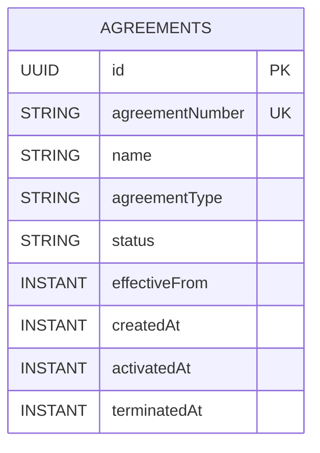

# Agreements Module Data Model (High-Level)

Updated: 2026-03-01

## Entity Diagram

## Relationship Notes

- This initial `agreements` slice models a single aggregate (`Agreement`) with no external entity links.
- `agreementNumber` is the external business identifier and is normalized to uppercase.
- `agreementNumber` is also the direct-read lookup key for `GET /api/agreements/{agreementNumber}`.
- `agreementType` is stored as an uppercase normalized string for consistent filtering/parity expansion.
- `status` starts as `DRAFT` and currently supports transitions to `ACTIVE` or `TERMINATED`.
- Transition timestamps:
  - `activatedAt` set when agreement transitions to `ACTIVE`
  - `terminatedAt` set when agreement transitions to `TERMINATED`
- Listing/query behavior:
  - agreements list endpoint supports optional `status` filter (`DRAFT`, `ACTIVE`, `TERMINATED`)
  - list results are sorted by `createdAt DESC`

## Constraint Notes

- Unique constraints:
  - `agreements(agreementNumber)`
