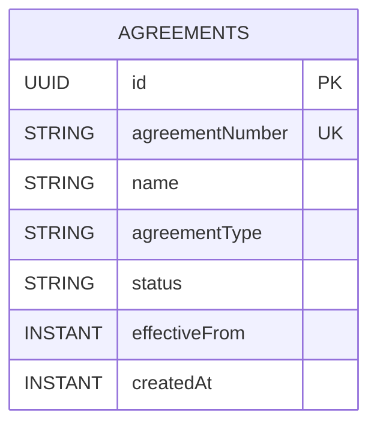

# Agreements Module Data Model (High-Level)

Updated: 2026-03-01

## Entity Diagram

## Relationship Notes

- This initial `agreements` slice models a single aggregate (`Agreement`) with no external entity links.
- `agreementNumber` is the external business identifier and is normalized to uppercase.
- `agreementType` is stored as an uppercase normalized string for consistent filtering/parity expansion.
- `status` starts as `DRAFT` in this first slice.

## Constraint Notes

- Unique constraints:
  - `agreements(agreementNumber)`
