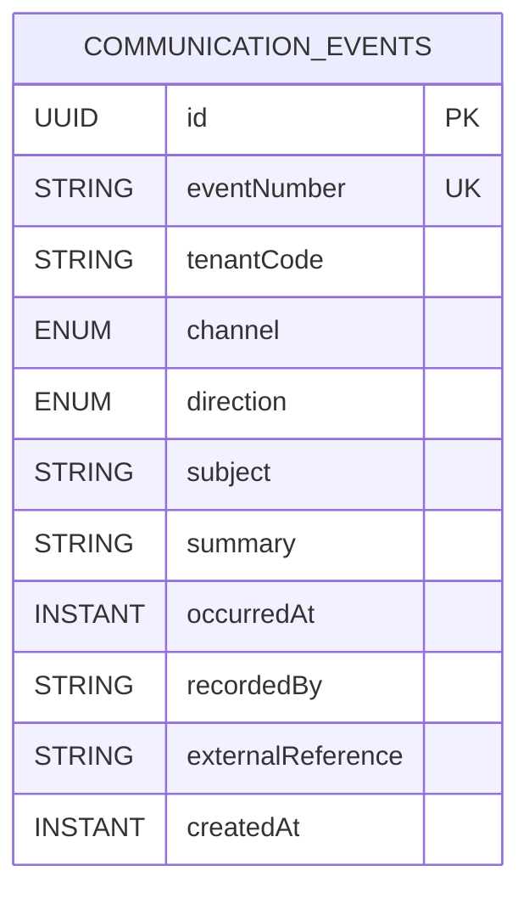

# Communication Events Module Data Model (High-Level)

Updated: 2026-04-18

## Entity Diagram

## Relationship Notes

- `communication_events.tenantCode` is a logical reference to the owning tenant in `identity`.
- `communication_events.recordedBy` is validated against `identity` actor lookup within `tenantCode`.
- The first slice keeps communication events as a single tenant-scoped log aggregate instead of reproducing the legacy party-role/contact-mechanism graph.

## Constraint and Index Notes

- Unique constraints:
  - `communication_events(tenantCode, eventNumber)`
- Indexes:
  - `communication_events(tenantCode, occurredAt)`
  - `communication_events(tenantCode, channel)`
  - `communication_events(tenantCode, direction)`
  - `communication_events(tenantCode, recordedBy)`
