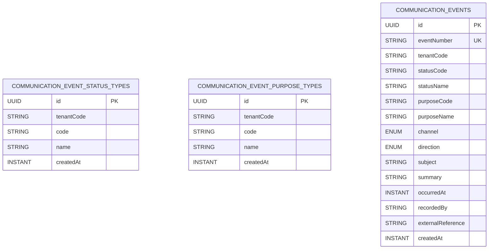

# Communication Events Module Data Model (High-Level)

Updated: 2026-04-18

## Entity Diagram

## Relationship Notes

- `communication_events.tenantCode` is a logical reference to the owning tenant in `identity`.
- `communication_events.recordedBy` is validated against `identity` actor lookup within `tenantCode`.
- `communication_event_status_types` and `communication_event_purpose_types` are tenant-local catalogs used to validate event creation.
- Events snapshot `statusCode/statusName` and `purposeCode/purposeName` at write time so event reads do not depend on live joins to the reference-data tables.
- The current slice still keeps communication events as a small tenant-scoped log aggregate instead of reproducing the legacy party-role/contact-mechanism graph.

## Constraint and Index Notes

- Unique constraints:
  - `communication_events(tenantCode, eventNumber)`
  - `communication_event_status_types(tenantCode, code)`
  - `communication_event_purpose_types(tenantCode, code)`
- Indexes:
  - `communication_events(tenantCode, occurredAt)`
  - `communication_events(tenantCode, channel)`
  - `communication_events(tenantCode, direction)`
  - `communication_events(tenantCode, recordedBy)`
  - `communication_event_status_types(tenantCode)`
  - `communication_event_purpose_types(tenantCode)`
