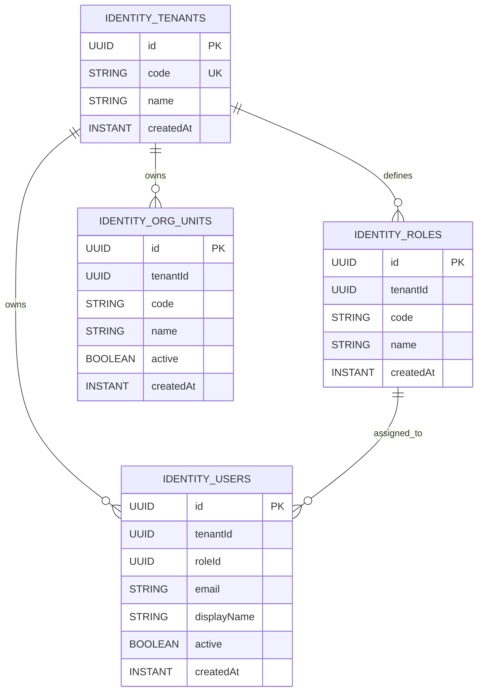

# Identity Module Data Model (High-Level)

Updated: 2026-03-01

## Entity Diagram

## Relationship Notes

- `identity_roles.tenantId` is a logical reference to `identity_tenants.id`.
- `identity_users.tenantId` is a logical reference to `identity_tenants.id`.
- `identity_users.roleId` is a logical reference to `identity_roles.id`.
- `identity_org_units.tenantId` is a logical reference to `identity_tenants.id`.
- Relationships are modeled as explicit IDs (no bidirectional JPA mappings).

## Constraint and Index Notes

- Unique constraints:
  - `identity_tenants(code)`
  - `identity_roles(tenantId, code)`
  - `identity_users(tenantId, email)`
  - `identity_org_units(tenantId, code)`
- Indexes:
  - `identity_roles(tenantId)`
  - `identity_users(tenantId)`
  - `identity_users(roleId)`
  - `identity_org_units(tenantId)`
