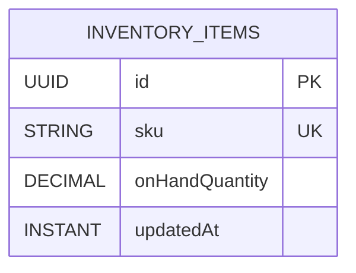

# Inventory Module Data Model (High-Level)

Updated: 2026-03-01

## Entity Diagram

## Relationship Notes

- `inventory_items.sku` is a business-key link to product SKU semantics (no cross-module foreign key).
- The module uses direct SKU lookup for on-hand reads.

## Constraint Notes

- Unique constraints:
  - `inventory_items(sku)`
