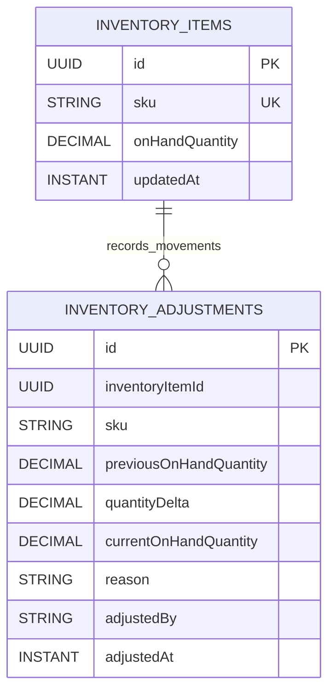

# Inventory Module Data Model (High-Level)

Updated: 2026-03-01

## Entity Diagram

## Relationship Notes

- `inventory_items.sku` is a business-key link to product SKU semantics (no cross-module foreign key).
- `inventory_adjustments.inventoryItemId` is a logical reference to `inventory_items.id`.
- Inventory changes are append-only via `inventory_adjustments`; `inventory_items.onHandQuantity` stores latest state.

## Constraint Notes

- Unique constraints:
  - `inventory_items(sku)`
- Indexes:
  - `inventory_adjustments(inventoryItemId, adjustedAt)`
  - `inventory_adjustments(inventoryItemId, adjustedBy, adjustedAt)`
