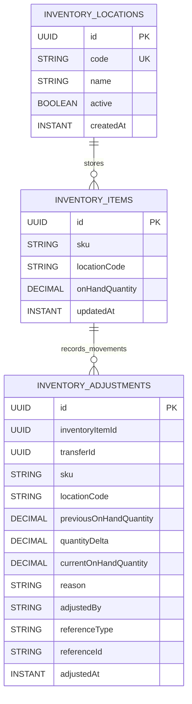

# Inventory Module Data Model (High-Level)

Updated: 2026-03-01

## Entity Diagram

## Relationship Notes

- Inventory on-hand is segmented by `sku + locationCode`.
- `inventory_items.locationCode` aligns with `inventory_locations.code` (code-based location reference).
- `inventory_adjustments.inventoryItemId` is a logical reference to `inventory_items.id`.
- Inventory changes are append-only via `inventory_adjustments`; `inventory_items.onHandQuantity` stores latest per-location state.
- Location transfers write two adjustment rows with a shared `transferId` (source negative delta, destination positive delta).
- Transfer rows can optionally carry source-document metadata (`referenceType`, `referenceId`) for parity traceability.
- Transfer reversals are modeled as new transfer pairs where `referenceType = TRANSFER_REVERSAL` and `referenceId = <originalTransferId>`.

## Constraint Notes

- Unique constraints:
  - `inventory_locations(code)`
  - `inventory_items(sku, locationCode)`
- Indexes:
  - `inventory_adjustments(inventoryItemId, adjustedAt)`
  - `inventory_adjustments(inventoryItemId, adjustedBy, adjustedAt)`
  - `inventory_adjustments(transferId)`
  - `inventory_adjustments(sku, referenceType, referenceId, adjustedAt)`
