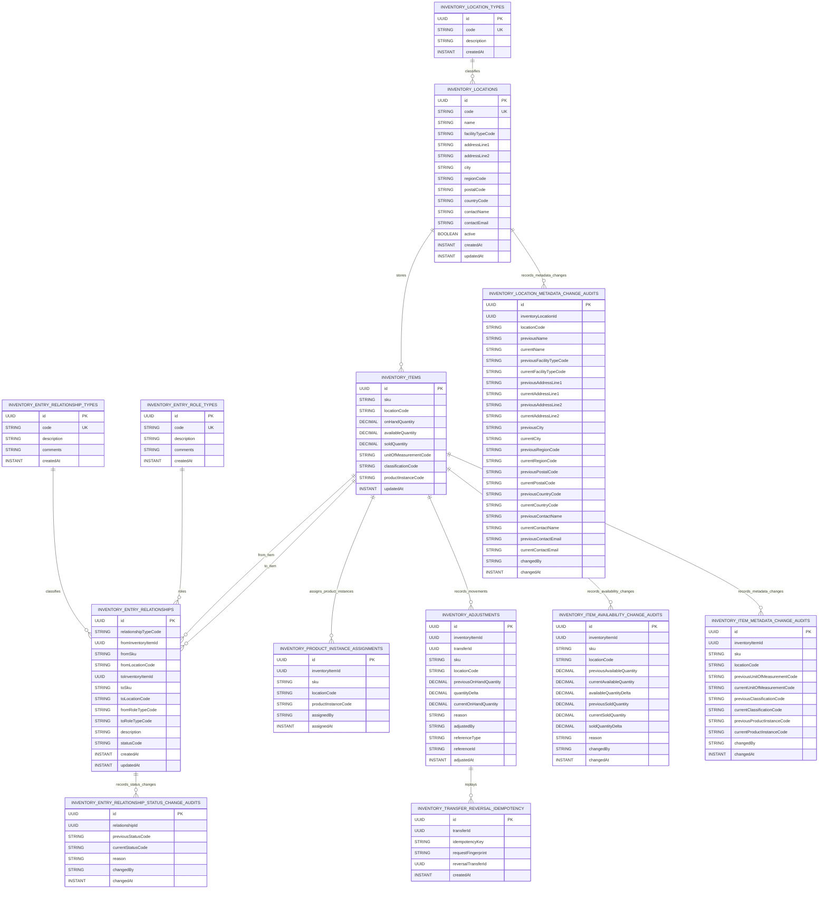

# Inventory Module Data Model (High-Level)

Updated: 2026-09-04

## Entity Diagram

```mermaid
erDiagram
    INVENTORY_LOCATION_TYPES ||--o{ INVENTORY_LOCATIONS : classifies
    INVENTORY_ENTRY_RELATIONSHIP_TYPES ||--o{ INVENTORY_ENTRY_RELATIONSHIPS : classifies
    INVENTORY_ENTRY_ROLE_TYPES ||--o{ INVENTORY_ENTRY_RELATIONSHIPS : roles
    INVENTORY_ITEMS ||--o{ INVENTORY_ENTRY_RELATIONSHIPS : from_item
    INVENTORY_ITEMS ||--o{ INVENTORY_ENTRY_RELATIONSHIPS : to_item
    INVENTORY_ENTRY_RELATIONSHIPS ||--o{ INVENTORY_ENTRY_RELATIONSHIP_STATUS_CHANGE_AUDITS : records_status_changes
    INVENTORY_ITEMS ||--o{ INVENTORY_PRODUCT_INSTANCE_ASSIGNMENTS : assigns_product_instances
    INVENTORY_LOCATIONS ||--o{ INVENTORY_ITEMS : stores
    INVENTORY_LOCATIONS ||--o{ INVENTORY_LOCATION_METADATA_CHANGE_AUDITS : records_metadata_changes
    INVENTORY_ITEMS ||--o{ INVENTORY_ADJUSTMENTS : records_movements
    INVENTORY_ITEMS ||--o{ INVENTORY_ITEM_AVAILABILITY_CHANGE_AUDITS : records_availability_changes
    INVENTORY_ITEMS ||--o{ INVENTORY_ITEM_METADATA_CHANGE_AUDITS : records_metadata_changes
    INVENTORY_ADJUSTMENTS ||--o{ INVENTORY_TRANSFER_REVERSAL_IDEMPOTENCY : replays

    INVENTORY_LOCATION_TYPES {
      UUID id PK
      STRING code UK
      STRING description
      INSTANT createdAt
    }

    INVENTORY_ENTRY_RELATIONSHIP_TYPES {
      UUID id PK
      STRING code UK
      STRING description
      STRING comments
      INSTANT createdAt
    }

    INVENTORY_ENTRY_ROLE_TYPES {
      UUID id PK
      STRING code UK
      STRING description
      STRING comments
      INSTANT createdAt
    }

    INVENTORY_ENTRY_RELATIONSHIPS {
      UUID id PK
      STRING relationshipTypeCode
      UUID fromInventoryItemId
      STRING fromSku
      STRING fromLocationCode
      UUID toInventoryItemId
      STRING toSku
      STRING toLocationCode
      STRING fromRoleTypeCode
      STRING toRoleTypeCode
      STRING description
      STRING statusCode
      INSTANT createdAt
      INSTANT updatedAt
    }

    INVENTORY_ENTRY_RELATIONSHIP_STATUS_CHANGE_AUDITS {
      UUID id PK
      UUID relationshipId
      STRING previousStatusCode
      STRING currentStatusCode
      STRING reason
      STRING changedBy
      INSTANT changedAt
    }

    INVENTORY_PRODUCT_INSTANCE_ASSIGNMENTS {
      UUID id PK
      UUID inventoryItemId
      STRING sku
      STRING locationCode
      STRING productInstanceCode
      STRING assignedBy
      INSTANT assignedAt
    }

    INVENTORY_LOCATIONS {
      UUID id PK
      STRING code UK
      STRING name
      STRING facilityTypeCode
      STRING addressLine1
      STRING addressLine2
      STRING city
      STRING regionCode
      STRING postalCode
      STRING countryCode
      STRING contactName
      STRING contactEmail
      BOOLEAN active
      INSTANT createdAt
      INSTANT updatedAt
    }

    INVENTORY_ITEMS {
      UUID id PK
      STRING sku
      STRING locationCode
      DECIMAL onHandQuantity
      DECIMAL availableQuantity
      DECIMAL soldQuantity
      STRING unitOfMeasurementCode
      STRING classificationCode
      STRING productInstanceCode
      INSTANT updatedAt
    }

    INVENTORY_LOCATION_METADATA_CHANGE_AUDITS {
      UUID id PK
      UUID inventoryLocationId
      STRING locationCode
      STRING previousName
      STRING currentName
      STRING previousFacilityTypeCode
      STRING currentFacilityTypeCode
      STRING previousAddressLine1
      STRING currentAddressLine1
      STRING previousAddressLine2
      STRING currentAddressLine2
      STRING previousCity
      STRING currentCity
      STRING previousRegionCode
      STRING currentRegionCode
      STRING previousPostalCode
      STRING currentPostalCode
      STRING previousCountryCode
      STRING currentCountryCode
      STRING previousContactName
      STRING currentContactName
      STRING previousContactEmail
      STRING currentContactEmail
      STRING changedBy
      INSTANT changedAt
    }

    INVENTORY_ADJUSTMENTS {
      UUID id PK
      UUID inventoryItemId
      UUID transferId
      STRING sku
      STRING locationCode
      DECIMAL previousOnHandQuantity
      DECIMAL quantityDelta
      DECIMAL currentOnHandQuantity
      STRING reason
      STRING adjustedBy
      STRING referenceType
      STRING referenceId
      INSTANT adjustedAt
    }

    INVENTORY_ITEM_METADATA_CHANGE_AUDITS {
      UUID id PK
      UUID inventoryItemId
      STRING sku
      STRING locationCode
      STRING previousUnitOfMeasurementCode
      STRING currentUnitOfMeasurementCode
      STRING previousClassificationCode
      STRING currentClassificationCode
      STRING previousProductInstanceCode
      STRING currentProductInstanceCode
      STRING changedBy
      INSTANT changedAt
    }

    INVENTORY_ITEM_AVAILABILITY_CHANGE_AUDITS {
      UUID id PK
      UUID inventoryItemId
      STRING sku
      STRING locationCode
      DECIMAL previousAvailableQuantity
      DECIMAL currentAvailableQuantity
      DECIMAL availableQuantityDelta
      DECIMAL previousSoldQuantity
      DECIMAL currentSoldQuantity
      DECIMAL soldQuantityDelta
      STRING reason
      STRING changedBy
      INSTANT changedAt
    }

    INVENTORY_TRANSFER_REVERSAL_IDEMPOTENCY {
      UUID id PK
      UUID transferId
      STRING idempotencyKey
      STRING requestFingerprint
      UUID reversalTransferId
      INSTANT createdAt
    }
```

## Relationship Notes

- Inventory on-hand, available, and sold counters are segmented by `sku + locationCode`.
- Inventory entry relationship and role types are reference data for entry relationship records.
- Inventory entry relationships link two existing inventory items and preserve normalized item keys for filtering.
- Inventory entry relationship status changes are append-only via `inventory_entry_relationship_status_change_audits`.
- Inventory product-instance assignments are explicit cross-reference rows from inventory items to product instance codes.
- Inventory locations carry optional facility type, address, and contact metadata for facility-model parity.
- Inventory location `facilityTypeCode` values are optional, but supplied codes must exist in `inventory_location_types`.
- Inventory location metadata changes are append-only via `inventory_location_metadata_change_audits`.
- Inventory item state carries `onHandQuantity`, `availableQuantity`, and `soldQuantity` for legacy inventory-entry parity with `number_in_stock`, `number_available`, and `number_sold`.
- Inventory item metadata carries `unitOfMeasurementCode`, `classificationCode`, and optional `productInstanceCode` for legacy inventory-entry parity.
- Inventory item `unitOfMeasurementCode` values are validated against the core UOM catalog at item registration and metadata update boundaries.
- `inventory_items.locationCode` aligns with `inventory_locations.code` (code-based location reference).
- `inventory_adjustments.inventoryItemId` is a logical reference to `inventory_items.id`.
- `inventory_item_metadata_change_audits.inventoryItemId` is a logical reference to `inventory_items.id`.
- `inventory_entry_relationships.fromInventoryItemId` and `toInventoryItemId` are logical references to `inventory_items.id`.
- `inventory_entry_relationship_status_change_audits.relationshipId` is a logical reference to `inventory_entry_relationships.id`.
- `inventory_product_instance_assignments.inventoryItemId` is a logical reference to `inventory_items.id`.
- Inventory changes are append-only via `inventory_adjustments`; `inventory_items.onHandQuantity` and `inventory_items.availableQuantity` store latest per-location state.
- Inventory item availability changes are append-only via `inventory_item_availability_change_audits`.
- Inventory item metadata changes are append-only via `inventory_item_metadata_change_audits`.
- Location transfers write two adjustment rows with a shared `transferId` (source negative delta, destination positive delta).
- Destination stock rows created by transfers copy the source item's UOM, classification, and product-instance metadata.
- Transfer rows can optionally carry source-document metadata (`referenceType`, `referenceId`) for parity traceability.
- Transfer reversals are modeled as new transfer pairs where `referenceType = TRANSFER_REVERSAL` and `referenceId = <originalTransferId>`.
- Reversal idempotency keys are tracked in `inventory_transfer_reversal_idempotency` for replay-safe reversal retries.
- `requestFingerprint` stores a stable hash of normalized reversal request body fields to reject same-key reuse with divergent payloads.
- `(transferId, idempotencyKey)` uniqueness is also used as a write-claim to prevent duplicate reversal creation under concurrent same-key requests.
- Pending idempotency claims are treated as stale after 5 minutes by default; this is configurable via `arcanaerp.inventory.reversal-idempotency.pending-claim-ttl`.

## Constraint Notes

- Unique constraints:
  - `inventory_location_types(code)`
  - `inventory_entry_relationship_types(code)`
  - `inventory_entry_role_types(code)`
  - `inventory_product_instance_assignments(inventoryItemId, productInstanceCode)`
  - `inventory_locations(code)`
  - `inventory_items(sku, locationCode)`
  - `inventory_transfer_reversal_idempotency(transferId, idempotencyKey)`
- Indexes:
  - `inventory_adjustments(inventoryItemId, adjustedAt)`
  - `inventory_adjustments(inventoryItemId, adjustedBy, adjustedAt)`
  - `inventory_adjustments(transferId)`
  - `inventory_adjustments(sku, referenceType, referenceId, adjustedAt)`
  - `inventory_location_metadata_change_audits(inventoryLocationId, changedAt)`
  - `inventory_location_metadata_change_audits(locationCode, changedAt)`
  - `inventory_item_metadata_change_audits(inventoryItemId, changedAt)`
  - `inventory_item_metadata_change_audits(sku, locationCode, changedAt)`
  - `inventory_item_availability_change_audits(inventoryItemId, changedAt)`
  - `inventory_item_availability_change_audits(sku, locationCode, changedAt)`
  - `inventory_entry_relationships(relationshipTypeCode)`
  - `inventory_entry_relationships(fromSku, fromLocationCode)`
  - `inventory_entry_relationships(toSku, toLocationCode)`
  - `inventory_entry_relationship_status_change_audits(relationshipId, changedAt)`
  - `inventory_entry_relationship_status_change_audits(changedBy, changedAt)`
  - `inventory_product_instance_assignments(productInstanceCode)`
  - `inventory_product_instance_assignments(sku, locationCode)`
  - `inventory_product_instance_assignments(assignedBy, assignedAt)`
  - `inventory_transfer_reversal_idempotency(reversalTransferId)`

## Minimal HTTP Surface

- `POST /api/inventory/location-types`
- `GET /api/inventory/location-types/{code}`
- `GET /api/inventory/location-types?page=&size=`
- `POST /api/inventory/entry-relationship-types`
- `GET /api/inventory/entry-relationship-types/{code}`
- `GET /api/inventory/entry-relationship-types?page=&size=`
- `POST /api/inventory/entry-role-types`
- `GET /api/inventory/entry-role-types/{code}`
- `GET /api/inventory/entry-role-types?page=&size=`
- `POST /api/inventory/entry-relationships`
- `GET /api/inventory/entry-relationships/{id}`
- `PATCH /api/inventory/entry-relationships/{id}/status`
- `GET /api/inventory/entry-relationships/{id}/status-history?page=&size=&changedBy=&changedAtFrom=&changedAtTo=`
- `GET /api/inventory/entry-relationships?page=&size=&relationshipTypeCode=&fromSku=&fromLocationCode=&toSku=&toLocationCode=&statusCode=`
- `POST /api/inventory/product-instance-assignments`
- `GET /api/inventory/product-instance-assignments/{id}`
- `GET /api/inventory/product-instance-assignments?page=&size=&sku=&locationCode=&productInstanceCode=&assignedBy=`
- `POST /api/inventory/locations`
- `GET /api/inventory/locations/{code}`
- `PATCH /api/inventory/locations/{code}/metadata`
- `GET /api/inventory/locations/{code}/metadata-history?page=&size=&changedBy=&changedAtFrom=&changedAtTo=`
- `PATCH /api/inventory/locations/{code}/active`
- `GET /api/inventory/locations?page=&size=&active=`
- `POST /api/inventory/items`
- `GET /api/inventory/items?page=&size=&sku=&locationCode=&unitOfMeasurementCode=&classificationCode=&productInstanceCode=`
- `GET /api/inventory/items/{sku}/locations/{locationCode}`
- `PATCH /api/inventory/items/{sku}/locations/{locationCode}/availability`
- `GET /api/inventory/items/{sku}/locations/{locationCode}/availability-history?page=&size=&changedBy=&changedAtFrom=&changedAtTo=`
- `PATCH /api/inventory/items/{sku}/locations/{locationCode}/metadata`
- `GET /api/inventory/items/{sku}/locations/{locationCode}/metadata-history?page=&size=&changedBy=&changedAtFrom=&changedAtTo=`
- `GET /api/inventory/{sku}?locationCode=` (`locationCode` defaults to `MAIN`)
- `GET /api/inventory/{sku}/adjustments?page=&size=&locationCode=&adjustedBy=&adjustedAtFrom=&adjustedAtTo=` (`locationCode` defaults to `MAIN`)
- `POST /api/inventory/{sku}/adjustments?locationCode=` (`locationCode` defaults to `MAIN`)
- `POST /api/inventory/{sku}/transfers`
- `GET /api/inventory/transfers/{transferId}`
- `POST /api/inventory/transfers/{transferId}/reversals` (optional `Idempotency-Key` header for retry-safe replay; reusing a key with a different payload returns `409 Conflict`; concurrent first-write requests with the same key return `409 Conflict`; stale pending claims are automatically reclaimed after 5 minutes on retry)
- `GET /api/inventory/transfers/{transferId}/reversals?page=&size=`
- `GET /api/inventory/{sku}/transfers?page=&size=&sourceLocationCode=&destinationLocationCode=&adjustedBy=&referenceType=&referenceId=&adjustedAtFrom=&adjustedAtTo=`
- `GET /api/inventory/{sku}/transfer-activity/daily-summary?page=&size=&sourceLocationCode=&destinationLocationCode=&adjustedBy=&referenceType=&referenceId=&adjustedAtFrom=&adjustedAtTo=`
- `GET /api/inventory/{sku}/transfer-activity/daily-summary/by-reference?page=&size=&sourceLocationCode=&destinationLocationCode=&adjustedBy=&referenceType=&referenceId=&adjustedAtFrom=&adjustedAtTo=`
- `GET /api/inventory/{sku}/transfer-activity/weekly-summary?page=&size=&sourceLocationCode=&destinationLocationCode=&adjustedBy=&referenceType=&referenceId=&adjustedAtFrom=&adjustedAtTo=`
- `GET /api/inventory/{sku}/transfer-activity/weekly-summary/by-reference?page=&size=&sourceLocationCode=&destinationLocationCode=&adjustedBy=&referenceType=&referenceId=&adjustedAtFrom=&adjustedAtTo=`
- `GET /api/inventory/{sku}/transfer-activity/monthly-summary?page=&size=&sourceLocationCode=&destinationLocationCode=&adjustedBy=&referenceType=&referenceId=&adjustedAtFrom=&adjustedAtTo=`
- `GET /api/inventory/{sku}/transfer-activity/monthly-summary/by-reference?page=&size=&sourceLocationCode=&destinationLocationCode=&adjustedBy=&referenceType=&referenceId=&adjustedAtFrom=&adjustedAtTo=`
- `GET /api/inventory/{sku}/adjustment-activity/daily-summary?page=&size=&locationCode=&adjustedBy=&adjustedAtFrom=&adjustedAtTo=` (`locationCode` defaults to `MAIN`)
- `GET /api/inventory/{sku}/adjustment-activity/daily-summary/by-location?page=&size=&locationCode=&adjustedBy=&adjustedAtFrom=&adjustedAtTo=`
- `GET /api/inventory/{sku}/adjustment-activity/daily-summary/by-adjusted-by?page=&size=&locationCode=&adjustedBy=&adjustedAtFrom=&adjustedAtTo=`
- `GET /api/inventory/{sku}/adjustment-activity/weekly-summary?page=&size=&locationCode=&adjustedBy=&adjustedAtFrom=&adjustedAtTo=` (`locationCode` defaults to `MAIN`)
- `GET /api/inventory/{sku}/adjustment-activity/weekly-summary/by-location?page=&size=&locationCode=&adjustedBy=&adjustedAtFrom=&adjustedAtTo=`
- `GET /api/inventory/{sku}/adjustment-activity/weekly-summary/by-adjusted-by?page=&size=&locationCode=&adjustedBy=&adjustedAtFrom=&adjustedAtTo=`
- `GET /api/inventory/{sku}/adjustment-activity/monthly-summary?page=&size=&locationCode=&adjustedBy=&adjustedAtFrom=&adjustedAtTo=` (`locationCode` defaults to `MAIN`)
- `GET /api/inventory/{sku}/adjustment-activity/monthly-summary/by-location?page=&size=&locationCode=&adjustedBy=&adjustedAtFrom=&adjustedAtTo=`
- `GET /api/inventory/{sku}/adjustment-activity/monthly-summary/by-adjusted-by?page=&size=&locationCode=&adjustedBy=&adjustedAtFrom=&adjustedAtTo=`

## Query Notes

- inventory location codes are normalized to uppercase at write and lookup boundaries
- inventory entry relationship and role type codes are normalized to uppercase at write and lookup boundaries
- inventory entry relationship writes validate relationship type, role types, from item, and to item before persisting
- inventory entry relationship list filters match normalized relationship type, item keys, and status code values
- inventory product-instance assignment writes validate the inventory item and reject duplicate item/product-instance pairs
- inventory product-instance assignment list filters match normalized item keys, product instance code, and assignedBy values
- inventory location facility type, region, and country codes are normalized to uppercase; contact email is normalized to lowercase
- inventory location facility type codes must exist in the inventory location type catalog when supplied
- inventory location metadata updates require `changedBy`, reject no-op changes, and append audit rows
- inventory location metadata history filters match lowercase `changedBy` and inclusive UTC `changedAt` ranges
- inactive inventory locations remain readable but reject new adjustment and transfer writes
- inventory item UOM and classification codes default to `EA` and `ON_HAND` when not explicitly supplied
- inventory item available quantity defaults to on-hand quantity, sold quantity defaults to zero, and available quantity cannot exceed on-hand quantity
- inventory item availability updates mutate available and sold quantities without changing physical on-hand quantity
- inventory item availability history filters match lowercase `changedBy` and inclusive UTC `changedAt` ranges
- inventory item product instance codes are optional and normalized to uppercase when supplied
- supplied and default inventory item UOM codes must exist in the core unit-of-measurement catalog
- inventory item list filters match normalized `sku`, `locationCode`, `unitOfMeasurementCode`, `classificationCode`, and `productInstanceCode` values
- inventory item metadata updates preserve on-hand quantity, require `changedBy`, reject no-op changes, and append audit rows
- inventory item metadata history filters match lowercase `changedBy` and inclusive UTC `changedAt` ranges
- adjustment activity summaries bucket append-only `inventory_adjustments` rows by UTC `adjustedAt`
- weekly adjustment activity summaries use Monday as the business week start
- adjustment activity rows include `adjustmentCount` and `netQuantityDelta` for the requested `sku + locationCode`
- by-location adjustment activity rows scan all locations for the requested SKU unless `locationCode` is supplied
- transfer activity summaries bucket paired transfer rows by UTC `adjustedAt`, source location, destination location, and `adjustedBy`
- by-reference transfer activity summaries bucket paired transfer rows by UTC `adjustedAt`, `referenceType`, and `referenceId`
- transfer activity rows include `transferCount` and `totalQuantity`; weekly transfer summaries use Monday as the business week start
