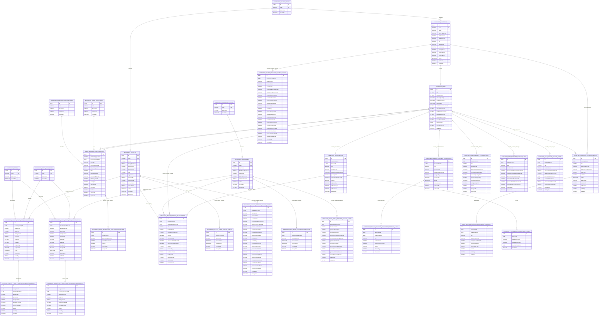

# Inventory Module Data Model (High-Level)

Updated: 2026-09-06

## Entity Diagram

```mermaid
erDiagram
    INVENTORY_LOCATION_TYPES ||--o{ INVENTORY_LOCATIONS : classifies
    INVENTORY_LOCATION_TYPES ||--o{ INVENTORY_FACILITIES : classifies
    INVENTORY_FIXED_ASSET_TYPES ||--o{ INVENTORY_FIXED_ASSETS : classifies
    INVENTORY_PARTIES ||--o{ INVENTORY_FACILITY_PARTY_ROLE_ASSIGNMENTS : participates
    INVENTORY_PARTIES ||--o{ INVENTORY_FIXED_ASSET_PARTY_ROLE_ASSIGNMENTS : participates
    INVENTORY_PARTY_ROLE_TYPES ||--o{ INVENTORY_FACILITY_PARTY_ROLE_ASSIGNMENTS : classifies
    INVENTORY_PARTY_ROLE_TYPES ||--o{ INVENTORY_FIXED_ASSET_PARTY_ROLE_ASSIGNMENTS : classifies
    INVENTORY_ENTRY_RELATIONSHIP_TYPES ||--o{ INVENTORY_ENTRY_RELATIONSHIPS : classifies
    INVENTORY_ENTRY_ROLE_TYPES ||--o{ INVENTORY_ENTRY_RELATIONSHIPS : roles
    INVENTORY_ITEMS ||--o{ INVENTORY_ENTRY_RELATIONSHIPS : from_item
    INVENTORY_ITEMS ||--o{ INVENTORY_ENTRY_RELATIONSHIPS : to_item
    INVENTORY_ENTRY_RELATIONSHIPS ||--o{ INVENTORY_ENTRY_RELATIONSHIP_STATUS_CHANGE_AUDITS : records_status_changes
    INVENTORY_FACILITIES ||--o{ INVENTORY_PICKUP_DROPOFF_TRANSACTIONS : traces_facility
    INVENTORY_FACILITIES ||--o{ INVENTORY_FACILITY_ACTIVE_CHANGE_AUDITS : records_active_changes
    INVENTORY_FACILITIES ||--o{ INVENTORY_FACILITY_METADATA_CHANGE_AUDITS : records_metadata_changes
    INVENTORY_FACILITIES ||--o{ INVENTORY_FACILITY_PARTY_ROLE_ASSIGNMENTS : assigns_party_roles
    INVENTORY_FACILITY_PARTY_ROLE_ASSIGNMENTS ||--o{ INVENTORY_FACILITY_PARTY_ROLE_ASSIGNMENT_END_AUDITS : records_ends
    INVENTORY_FIXED_ASSETS ||--o{ INVENTORY_PICKUP_DROPOFF_TRANSACTIONS : traces_asset
    INVENTORY_FIXED_ASSETS ||--o{ INVENTORY_FIXED_ASSET_ACTIVE_CHANGE_AUDITS : records_active_changes
    INVENTORY_FIXED_ASSETS ||--o{ INVENTORY_FIXED_ASSET_METADATA_CHANGE_AUDITS : records_metadata_changes
    INVENTORY_FIXED_ASSETS ||--o{ INVENTORY_FIXED_ASSET_PARTY_ROLE_ASSIGNMENTS : assigns_party_roles
    INVENTORY_FIXED_ASSET_PARTY_ROLE_ASSIGNMENTS ||--o{ INVENTORY_FIXED_ASSET_PARTY_ROLE_ASSIGNMENT_END_AUDITS : records_ends
    INVENTORY_ITEMS ||--o{ INVENTORY_PRODUCT_INSTANCE_ASSIGNMENTS : assigns_product_instances
    INVENTORY_PRODUCT_INSTANCE_ASSIGNMENTS ||--o{ INVENTORY_PRODUCT_INSTANCE_ASSIGNMENT_RELEASE_AUDITS : records_releases
    INVENTORY_ITEMS ||--o{ INVENTORY_ITEM_LOCATION_ASSIGNMENTS : assigns_locations
    INVENTORY_ITEM_LOCATION_ASSIGNMENTS ||--o{ INVENTORY_ITEM_LOCATION_ASSIGNMENT_END_AUDITS : records_ends
    INVENTORY_LOCATIONS ||--o{ INVENTORY_ITEMS : stores
    INVENTORY_LOCATIONS ||--o{ INVENTORY_ITEM_LOCATION_ASSIGNMENTS : assigned_location
    INVENTORY_LOCATIONS ||--o{ INVENTORY_LOCATION_METADATA_CHANGE_AUDITS : records_metadata_changes
    INVENTORY_ITEMS ||--o{ INVENTORY_ADJUSTMENTS : records_movements
    INVENTORY_ITEMS ||--o{ INVENTORY_PICKUP_DROPOFF_TRANSACTIONS : records_pickups_dropoffs
    INVENTORY_ADJUSTMENTS ||--o{ INVENTORY_PICKUP_DROPOFF_TRANSACTIONS : links_stock_effect
    INVENTORY_ITEMS ||--o{ INVENTORY_ITEM_AVAILABILITY_CHANGE_AUDITS : records_availability_changes
    INVENTORY_ITEMS ||--o{ INVENTORY_ITEM_METADATA_CHANGE_AUDITS : records_metadata_changes
    INVENTORY_ITEMS ||--o{ INVENTORY_ITEM_OWNER_CHANGE_AUDITS : records_owner_changes
    INVENTORY_ADJUSTMENTS ||--o{ INVENTORY_TRANSFER_REVERSAL_IDEMPOTENCY : replays

    INVENTORY_LOCATION_TYPES {
      UUID id PK
      STRING code UK
      STRING description
      INSTANT createdAt
    }

    INVENTORY_FIXED_ASSET_TYPES {
      UUID id PK
      STRING code UK
      STRING description
      INSTANT createdAt
    }

    INVENTORY_PARTIES {
      UUID id PK
      STRING code UK
      STRING description
      INSTANT createdAt
    }

    INVENTORY_PARTY_ROLE_TYPES {
      UUID id PK
      STRING code UK
      STRING description
      INSTANT createdAt
    }

    INVENTORY_ENTRY_RELATIONSHIP_TYPES {
      UUID id PK
      STRING code UK
      STRING description
      STRING comments
      INSTANT createdAt
    }

    INVENTORY_ENTRY_ROLE_TYPES {
      UUID id PK
      STRING code UK
      STRING description
      STRING comments
      INSTANT createdAt
    }

    INVENTORY_ENTRY_RELATIONSHIPS {
      UUID id PK
      STRING relationshipTypeCode
      UUID fromInventoryItemId
      STRING fromSku
      STRING fromLocationCode
      UUID toInventoryItemId
      STRING toSku
      STRING toLocationCode
      STRING fromRoleTypeCode
      STRING toRoleTypeCode
      STRING description
      STRING statusCode
      INSTANT fromDate
      INSTANT thruDate
      INSTANT createdAt
      INSTANT updatedAt
    }

    INVENTORY_ENTRY_RELATIONSHIP_STATUS_CHANGE_AUDITS {
      UUID id PK
      UUID relationshipId
      STRING previousStatusCode
      STRING currentStatusCode
      STRING reason
      STRING changedBy
      INSTANT changedAt
    }

    INVENTORY_FACILITIES {
      UUID id PK
      STRING code UK
      STRING name
      STRING facilityTypeCode
      STRING addressLine1
      STRING addressLine2
      STRING city
      STRING regionCode
      STRING postalCode
      STRING countryCode
      STRING contactName
      STRING contactEmail
      BOOLEAN active
      INSTANT createdAt
      INSTANT updatedAt
    }

    INVENTORY_FACILITY_ACTIVE_CHANGE_AUDITS {
      UUID id PK
      UUID inventoryFacilityId
      STRING facilityCode
      BOOLEAN previousActive
      BOOLEAN currentActive
      STRING changedBy
      INSTANT changedAt
    }

    INVENTORY_FACILITY_METADATA_CHANGE_AUDITS {
      UUID id PK
      UUID inventoryFacilityId
      STRING facilityCode
      STRING previousName
      STRING currentName
      STRING previousFacilityTypeCode
      STRING currentFacilityTypeCode
      STRING previousAddressLine1
      STRING currentAddressLine1
      STRING previousAddressLine2
      STRING currentAddressLine2
      STRING previousCity
      STRING currentCity
      STRING previousRegionCode
      STRING currentRegionCode
      STRING previousPostalCode
      STRING currentPostalCode
      STRING previousCountryCode
      STRING currentCountryCode
      STRING previousContactName
      STRING currentContactName
      STRING previousContactEmail
      STRING currentContactEmail
      STRING changedBy
      INSTANT changedAt
    }

    INVENTORY_FACILITY_PARTY_ROLE_ASSIGNMENTS {
      UUID id PK
      UUID inventoryFacilityId
      STRING facilityCode
      STRING partyCode
      STRING roleTypeCode
      STRING comments
      INSTANT fromDate
      INSTANT thruDate
      STRING assignedBy
      INSTANT assignedAt
      BOOLEAN active
      STRING endReason
      STRING endedBy
      INSTANT endedAt
    }

    INVENTORY_FACILITY_PARTY_ROLE_ASSIGNMENT_END_AUDITS {
      UUID id PK
      UUID assignmentId
      UUID inventoryFacilityId
      STRING facilityCode
      STRING partyCode
      STRING roleTypeCode
      INSTANT previousThruDate
      INSTANT currentThruDate
      STRING reason
      STRING endedBy
      INSTANT endedAt
    }

    INVENTORY_FIXED_ASSETS {
      UUID id PK
      STRING code UK
      STRING description
      STRING fixedAssetTypeCode
      STRING comments
      STRING externalIdentifier
      STRING externalIdSource
      BOOLEAN active
      INSTANT createdAt
      INSTANT updatedAt
    }

    INVENTORY_FIXED_ASSET_ACTIVE_CHANGE_AUDITS {
      UUID id PK
      UUID inventoryFixedAssetId
      STRING fixedAssetCode
      BOOLEAN previousActive
      BOOLEAN currentActive
      STRING changedBy
      INSTANT changedAt
    }

    INVENTORY_FIXED_ASSET_METADATA_CHANGE_AUDITS {
      UUID id PK
      UUID inventoryFixedAssetId
      STRING fixedAssetCode
      STRING previousDescription
      STRING currentDescription
      STRING previousFixedAssetTypeCode
      STRING currentFixedAssetTypeCode
      STRING previousComments
      STRING currentComments
      STRING previousExternalIdentifier
      STRING currentExternalIdentifier
      STRING previousExternalIdSource
      STRING currentExternalIdSource
      STRING changedBy
      INSTANT changedAt
    }

    INVENTORY_FIXED_ASSET_PARTY_ROLE_ASSIGNMENTS {
      UUID id PK
      UUID inventoryFixedAssetId
      STRING fixedAssetCode
      STRING partyCode
      STRING roleTypeCode
      STRING comments
      INSTANT fromDate
      INSTANT thruDate
      STRING assignedBy
      INSTANT assignedAt
      BOOLEAN active
      STRING endReason
      STRING endedBy
      INSTANT endedAt
    }

    INVENTORY_FIXED_ASSET_PARTY_ROLE_ASSIGNMENT_END_AUDITS {
      UUID id PK
      UUID assignmentId
      UUID inventoryFixedAssetId
      STRING fixedAssetCode
      STRING partyCode
      STRING roleTypeCode
      INSTANT previousThruDate
      INSTANT currentThruDate
      STRING reason
      STRING endedBy
      INSTANT endedAt
    }

    INVENTORY_PRODUCT_INSTANCE_ASSIGNMENTS {
      UUID id PK
      UUID inventoryItemId
      STRING sku
      STRING locationCode
      STRING productInstanceCode
      STRING assignedBy
      INSTANT assignedAt
      BOOLEAN active
      STRING releaseReason
      STRING releasedBy
      INSTANT releasedAt
    }

    INVENTORY_PRODUCT_INSTANCE_ASSIGNMENT_RELEASE_AUDITS {
      UUID id PK
      UUID assignmentId
      UUID inventoryItemId
      STRING sku
      STRING locationCode
      STRING productInstanceCode
      STRING reason
      STRING releasedBy
      INSTANT releasedAt
    }

    INVENTORY_ITEM_LOCATION_ASSIGNMENTS {
      UUID id PK
      UUID inventoryItemId
      STRING sku
      STRING itemLocationCode
      STRING assignedLocationCode
      INSTANT validFrom
      INSTANT validThru
      BOOLEAN active
      STRING assignedBy
      INSTANT assignedAt
      STRING endReason
      STRING endedBy
      INSTANT endedAt
    }

    INVENTORY_ITEM_LOCATION_ASSIGNMENT_END_AUDITS {
      UUID id PK
      UUID assignmentId
      UUID inventoryItemId
      STRING sku
      STRING itemLocationCode
      STRING assignedLocationCode
      INSTANT previousValidThru
      INSTANT currentValidThru
      STRING reason
      STRING endedBy
      INSTANT endedAt
    }

    INVENTORY_LOCATIONS {
      UUID id PK
      STRING code UK
      STRING name
      STRING facilityTypeCode
      STRING addressLine1
      STRING addressLine2
      STRING city
      STRING regionCode
      STRING postalCode
      STRING countryCode
      STRING contactName
      STRING contactEmail
      BOOLEAN active
      INSTANT createdAt
      INSTANT updatedAt
    }

    INVENTORY_ITEMS {
      UUID id PK
      STRING sku
      STRING locationCode
      DECIMAL onHandQuantity
      DECIMAL availableQuantity
      DECIMAL soldQuantity
      STRING unitOfMeasurementCode
      STRING classificationCode
      STRING productInstanceCode
      STRING externalReference
      STRING sourceSystemCode
      STRING ownerTenantCode
      UUID ownerUserId
      STRING ownerRoleCode
      INSTANT updatedAt
    }

    INVENTORY_LOCATION_METADATA_CHANGE_AUDITS {
      UUID id PK
      UUID inventoryLocationId
      STRING locationCode
      STRING previousName
      STRING currentName
      STRING previousFacilityTypeCode
      STRING currentFacilityTypeCode
      STRING previousAddressLine1
      STRING currentAddressLine1
      STRING previousAddressLine2
      STRING currentAddressLine2
      STRING previousCity
      STRING currentCity
      STRING previousRegionCode
      STRING currentRegionCode
      STRING previousPostalCode
      STRING currentPostalCode
      STRING previousCountryCode
      STRING currentCountryCode
      STRING previousContactName
      STRING currentContactName
      STRING previousContactEmail
      STRING currentContactEmail
      STRING changedBy
      INSTANT changedAt
    }

    INVENTORY_ADJUSTMENTS {
      UUID id PK
      UUID inventoryItemId
      UUID transferId
      STRING sku
      STRING locationCode
      DECIMAL previousOnHandQuantity
      DECIMAL quantityDelta
      DECIMAL currentOnHandQuantity
      STRING reason
      STRING adjustedBy
      STRING referenceType
      STRING referenceId
      INSTANT adjustedAt
    }

    INVENTORY_PICKUP_DROPOFF_TRANSACTIONS {
      UUID id PK
      UUID inventoryItemId
      UUID inventoryAdjustmentId
      STRING sku
      STRING locationCode
      STRING transactionTypeCode
      DECIMAL quantity
      DECIMAL quantityDelta
      DECIMAL previousOnHandQuantity
      DECIMAL currentOnHandQuantity
      STRING reason
      STRING handledBy
      STRING fixedAssetCode
      STRING facilityCode
      STRING referenceType
      STRING referenceId
      INSTANT transactionAt
    }

    INVENTORY_ITEM_METADATA_CHANGE_AUDITS {
      UUID id PK
      UUID inventoryItemId
      STRING sku
      STRING locationCode
      STRING previousUnitOfMeasurementCode
      STRING currentUnitOfMeasurementCode
      STRING previousClassificationCode
      STRING currentClassificationCode
      STRING previousProductInstanceCode
      STRING currentProductInstanceCode
      STRING changedBy
      INSTANT changedAt
    }

    INVENTORY_ITEM_OWNER_CHANGE_AUDITS {
      UUID id PK
      UUID inventoryItemId
      STRING sku
      STRING locationCode
      STRING previousOwnerTenantCode
      STRING currentOwnerTenantCode
      UUID previousOwnerUserId
      UUID currentOwnerUserId
      STRING previousOwnerRoleCode
      STRING currentOwnerRoleCode
      STRING changedBy
      INSTANT changedAt
    }

    INVENTORY_ITEM_AVAILABILITY_CHANGE_AUDITS {
      UUID id PK
      UUID inventoryItemId
      STRING sku
      STRING locationCode
      DECIMAL previousAvailableQuantity
      DECIMAL currentAvailableQuantity
      DECIMAL availableQuantityDelta
      DECIMAL previousSoldQuantity
      DECIMAL currentSoldQuantity
      DECIMAL soldQuantityDelta
      STRING reason
      STRING changedBy
      INSTANT changedAt
    }

    INVENTORY_TRANSFER_REVERSAL_IDEMPOTENCY {
      UUID id PK
      UUID transferId
      STRING idempotencyKey
      STRING requestFingerprint
      UUID reversalTransferId
      INSTANT createdAt
    }
```

## Relationship Notes

- Inventory on-hand, available, and sold counters are segmented by `sku + locationCode`.
- Inventory entry relationship and role types are reference data for entry relationship records.
- Inventory entry relationships link two existing inventory items and preserve normalized item keys for filtering.
- Inventory entry relationships support optional `fromDate` and `thruDate` validity windows.
- Inventory entry relationship status changes are append-only via `inventory_entry_relationship_status_change_audits`.
- Inventory facilities are a first-class catalog for legacy facility traceability; facility codes and facility type codes normalize to uppercase.
- Inventory facility active changes are append-only via `inventory_facility_active_change_audits`.
- Inventory facility metadata changes are append-only via `inventory_facility_metadata_change_audits`.
- Inventory facility party-role assignments link active facilities to normalized party and role type codes.
- Inventory facility party-role assignments validate `partyCode` against `inventory_parties` and `roleTypeCode` against `inventory_party_role_types`.
- Inventory facility party-role assignments support optional `fromDate` and `thruDate` validity windows.
- Inventory facility party-role assignment end operations mark assignments inactive, set `thruDate`, and append actor-attributed end audit rows.
- Inventory fixed assets are a first-class catalog for legacy fixed-asset traceability; fixed asset codes and type codes normalize to uppercase.
- Inventory fixed asset `fixedAssetTypeCode` values are optional, but supplied codes must exist in `inventory_fixed_asset_types`.
- Inventory fixed asset active changes are append-only via `inventory_fixed_asset_active_change_audits`.
- Inventory fixed asset metadata changes are append-only via `inventory_fixed_asset_metadata_change_audits`.
- Inventory fixed asset party-role assignments link active fixed assets to normalized party and role type codes.
- Inventory fixed asset party-role assignments validate `partyCode` against `inventory_parties` and `roleTypeCode` against `inventory_party_role_types`.
- Inventory fixed asset party-role assignments support optional `fromDate` and `thruDate` validity windows.
- Inventory fixed asset party-role assignment end operations mark assignments inactive, set `thruDate`, and append actor-attributed end audit rows.
- Inventory product-instance assignments are explicit cross-reference rows from inventory items to product instance codes.
- Inventory product-instance assignment releases are append-only via `inventory_product_instance_assignment_release_audits`.
- Inventory item-location assignments track valid-from/valid-thru placement history without mutating the stock row key.
- Inventory item-location assignment ends are append-only via `inventory_item_location_assignment_end_audits`.
- Inventory locations carry optional facility type, address, and contact metadata for facility-model parity.
- Inventory location and facility `facilityTypeCode` values are optional, but supplied codes must exist in `inventory_location_types`.
- Inventory location metadata changes are append-only via `inventory_location_metadata_change_audits`.
- Inventory item state carries `onHandQuantity`, `availableQuantity`, and `soldQuantity` for legacy inventory-entry parity with `number_in_stock`, `number_available`, and `number_sold`.
- Inventory item metadata carries `unitOfMeasurementCode`, `classificationCode`, optional `productInstanceCode`, optional `externalReference`, optional `sourceSystemCode`, and optional owner fields for legacy inventory-entry parity.
- Inventory item `unitOfMeasurementCode` values are validated against the core UOM catalog at item registration and metadata update boundaries.
- Inventory item `sourceSystemCode + externalReference` pairs are unique when both values are supplied.
- `inventory_items.locationCode` aligns with `inventory_locations.code` (code-based location reference).
- `inventory_adjustments.inventoryItemId` is a logical reference to `inventory_items.id`.
- `inventory_pickup_dropoff_transactions.inventoryItemId` is a logical reference to `inventory_items.id`.
- `inventory_pickup_dropoff_transactions.inventoryAdjustmentId` is a logical reference to `inventory_adjustments.id`.
- `inventory_facility_active_change_audits.inventoryFacilityId` is a logical reference to `inventory_facilities.id`.
- `inventory_facility_metadata_change_audits.inventoryFacilityId` is a logical reference to `inventory_facilities.id`.
- `inventory_facility_party_role_assignments.inventoryFacilityId` is a logical reference to `inventory_facilities.id`.
- `inventory_fixed_asset_active_change_audits.inventoryFixedAssetId` is a logical reference to `inventory_fixed_assets.id`.
- `inventory_fixed_asset_metadata_change_audits.inventoryFixedAssetId` is a logical reference to `inventory_fixed_assets.id`.
- `inventory_fixed_asset_party_role_assignments.inventoryFixedAssetId` is a logical reference to `inventory_fixed_assets.id`.
- `inventory_item_metadata_change_audits.inventoryItemId` is a logical reference to `inventory_items.id`.
- `inventory_item_owner_change_audits.inventoryItemId` is a logical reference to `inventory_items.id`.
- `inventory_entry_relationships.fromInventoryItemId` and `toInventoryItemId` are logical references to `inventory_items.id`.
- `inventory_entry_relationship_status_change_audits.relationshipId` is a logical reference to `inventory_entry_relationships.id`.
- `inventory_product_instance_assignments.inventoryItemId` is a logical reference to `inventory_items.id`.
- `inventory_product_instance_assignment_release_audits.assignmentId` is a logical reference to `inventory_product_instance_assignments.id`.
- `inventory_item_location_assignments.inventoryItemId` is a logical reference to `inventory_items.id`.
- `inventory_item_location_assignments.assignedLocationCode` aligns with `inventory_locations.code`.
- `inventory_item_location_assignment_end_audits.assignmentId` is a logical reference to `inventory_item_location_assignments.id`.
- Inventory changes are append-only via `inventory_adjustments`; `inventory_items.onHandQuantity` and `inventory_items.availableQuantity` store latest per-location state.
- Pickup/dropoff transactions are append-only via `inventory_pickup_dropoff_transactions`; `PICKUP` decreases on-hand stock and `DROPOFF` increases on-hand stock through a linked adjustment row.
- Pickup/dropoff transactions can carry optional `fixedAssetCode` and `facilityCode` values for legacy fixed-asset/facility traceability; `fixedAssetCode` must match an active inventory fixed asset and `facilityCode` must match an active inventory facility.
- Inventory item availability changes are append-only via `inventory_item_availability_change_audits`.
- Inventory item metadata changes are append-only via `inventory_item_metadata_change_audits`.
- Inventory item owner changes are append-only via `inventory_item_owner_change_audits`.
- Location transfers write two adjustment rows with a shared `transferId` (source negative delta, destination positive delta).
- Destination stock rows created by transfers copy the source item's UOM, classification, and product-instance metadata.
- Transfer rows can optionally carry source-document metadata (`referenceType`, `referenceId`) for parity traceability.
- Transfer reversals are modeled as new transfer pairs where `referenceType = TRANSFER_REVERSAL` and `referenceId = <originalTransferId>`.
- Reversal idempotency keys are tracked in `inventory_transfer_reversal_idempotency` for replay-safe reversal retries.
- `requestFingerprint` stores a stable hash of normalized reversal request body fields to reject same-key reuse with divergent payloads.
- `(transferId, idempotencyKey)` uniqueness is also used as a write-claim to prevent duplicate reversal creation under concurrent same-key requests.
- Pending idempotency claims are treated as stale after 5 minutes by default; this is configurable via `arcanaerp.inventory.reversal-idempotency.pending-claim-ttl`.

## Constraint Notes

- Unique constraints:
  - `inventory_location_types(code)`
  - `inventory_fixed_asset_types(code)`
  - `inventory_parties(code)`
  - `inventory_party_role_types(code)`
  - `inventory_entry_relationship_types(code)`
  - `inventory_entry_role_types(code)`
  - `inventory_facilities(code)`
  - `inventory_facility_party_role_assignments(inventoryFacilityId, partyCode, roleTypeCode)`
  - `inventory_fixed_assets(code)`
  - `inventory_fixed_asset_party_role_assignments(inventoryFixedAssetId, partyCode, roleTypeCode)`
  - `inventory_product_instance_assignments(inventoryItemId, productInstanceCode)`
  - `inventory_locations(code)`
  - `inventory_items(sku, locationCode)`
  - `inventory_items(sourceSystemCode, externalReference)`
  - `inventory_transfer_reversal_idempotency(transferId, idempotencyKey)`
- Indexes:
  - `inventory_facilities(active, code)`
  - `inventory_facility_active_change_audits(inventoryFacilityId, changedAt)`
  - `inventory_facility_active_change_audits(facilityCode, changedAt)`
  - `inventory_facility_metadata_change_audits(inventoryFacilityId, changedAt)`
  - `inventory_facility_metadata_change_audits(facilityCode, changedAt)`
  - `inventory_facility_party_role_assignments(facilityCode)`
  - `inventory_facility_party_role_assignments(partyCode, roleTypeCode)`
  - `inventory_facility_party_role_assignments(assignedBy, assignedAt)`
  - `inventory_facility_party_role_assignments(active)`
  - `inventory_facility_party_role_assignment_end_audits(assignmentId, endedAt)`
  - `inventory_facility_party_role_assignment_end_audits(facilityCode, partyCode, roleTypeCode, endedAt)`
  - `inventory_facility_party_role_assignment_end_audits(endedBy, endedAt)`
  - `inventory_fixed_assets(active, code)`
  - `inventory_fixed_asset_active_change_audits(inventoryFixedAssetId, changedAt)`
  - `inventory_fixed_asset_active_change_audits(fixedAssetCode, changedAt)`
  - `inventory_fixed_asset_metadata_change_audits(inventoryFixedAssetId, changedAt)`
  - `inventory_fixed_asset_metadata_change_audits(fixedAssetCode, changedAt)`
  - `inventory_fixed_asset_party_role_assignments(fixedAssetCode)`
  - `inventory_fixed_asset_party_role_assignments(partyCode, roleTypeCode)`
  - `inventory_fixed_asset_party_role_assignments(assignedBy, assignedAt)`
  - `inventory_fixed_asset_party_role_assignments(active)`
  - `inventory_fixed_asset_party_role_assignment_end_audits(assignmentId, endedAt)`
  - `inventory_fixed_asset_party_role_assignment_end_audits(fixedAssetCode, partyCode, roleTypeCode, endedAt)`
  - `inventory_fixed_asset_party_role_assignment_end_audits(endedBy, endedAt)`
  - `inventory_adjustments(inventoryItemId, adjustedAt)`
  - `inventory_adjustments(inventoryItemId, adjustedBy, adjustedAt)`
  - `inventory_adjustments(transferId)`
  - `inventory_adjustments(sku, referenceType, referenceId, adjustedAt)`
  - `inventory_pickup_dropoff_transactions(inventoryItemId, transactionAt)`
  - `inventory_pickup_dropoff_transactions(sku, transactionTypeCode, transactionAt)`
  - `inventory_pickup_dropoff_transactions(sku, referenceType, referenceId, transactionAt)`
  - `inventory_pickup_dropoff_transactions(sku, fixedAssetCode, transactionAt)`
  - `inventory_pickup_dropoff_transactions(sku, facilityCode, transactionAt)`
  - `inventory_pickup_dropoff_transactions(inventoryAdjustmentId)`
  - `inventory_location_metadata_change_audits(inventoryLocationId, changedAt)`
  - `inventory_location_metadata_change_audits(locationCode, changedAt)`
  - `inventory_item_metadata_change_audits(inventoryItemId, changedAt)`
  - `inventory_item_metadata_change_audits(sku, locationCode, changedAt)`
  - `inventory_item_owner_change_audits(inventoryItemId, changedAt)`
  - `inventory_item_owner_change_audits(sku, locationCode, changedAt)`
  - `inventory_item_availability_change_audits(inventoryItemId, changedAt)`
  - `inventory_item_availability_change_audits(sku, locationCode, changedAt)`
  - `inventory_entry_relationships(relationshipTypeCode)`
  - `inventory_entry_relationships(fromSku, fromLocationCode)`
  - `inventory_entry_relationships(toSku, toLocationCode)`
  - `inventory_entry_relationships(fromDate)`
  - `inventory_entry_relationships(thruDate)`
  - `inventory_entry_relationship_status_change_audits(relationshipId, changedAt)`
  - `inventory_entry_relationship_status_change_audits(changedBy, changedAt)`
  - `inventory_product_instance_assignments(productInstanceCode)`
  - `inventory_product_instance_assignments(sku, locationCode)`
  - `inventory_product_instance_assignments(assignedBy, assignedAt)`
  - `inventory_product_instance_assignment_release_audits(assignmentId, releasedAt)`
  - `inventory_product_instance_assignment_release_audits(productInstanceCode, releasedAt)`
  - `inventory_product_instance_assignment_release_audits(releasedBy, releasedAt)`
  - `inventory_item_location_assignments(inventoryItemId, validFrom, validThru)`
  - `inventory_item_location_assignments(sku, itemLocationCode)`
  - `inventory_item_location_assignments(assignedLocationCode)`
  - `inventory_item_location_assignments(active)`
  - `inventory_item_location_assignment_end_audits(assignmentId, endedAt)`
  - `inventory_item_location_assignment_end_audits(sku, itemLocationCode, endedAt)`
  - `inventory_item_location_assignment_end_audits(endedBy, endedAt)`
  - `inventory_transfer_reversal_idempotency(reversalTransferId)`

## Minimal HTTP Surface

- `POST /api/inventory/location-types`
- `GET /api/inventory/location-types/{code}`
- `GET /api/inventory/location-types?page=&size=`
- `POST /api/inventory/fixed-asset-types`
- `GET /api/inventory/fixed-asset-types/{code}`
- `GET /api/inventory/fixed-asset-types?page=&size=`
- `POST /api/inventory/parties`
- `GET /api/inventory/parties/{code}`
- `GET /api/inventory/parties?page=&size=`
- `POST /api/inventory/party-role-types`
- `GET /api/inventory/party-role-types/{code}`
- `GET /api/inventory/party-role-types?page=&size=`
- `POST /api/inventory/entry-relationship-types`
- `GET /api/inventory/entry-relationship-types/{code}`
- `GET /api/inventory/entry-relationship-types?page=&size=`
- `POST /api/inventory/entry-role-types`
- `GET /api/inventory/entry-role-types/{code}`
- `GET /api/inventory/entry-role-types?page=&size=`
- `POST /api/inventory/entry-relationships`
- `GET /api/inventory/entry-relationships/{id}`
- `PATCH /api/inventory/entry-relationships/{id}/status`
- `GET /api/inventory/entry-relationships/{id}/status-history?page=&size=&changedBy=&changedAtFrom=&changedAtTo=`
- `GET /api/inventory/entry-relationships?page=&size=&relationshipTypeCode=&fromSku=&fromLocationCode=&toSku=&toLocationCode=&statusCode=&fromDateFrom=&fromDateTo=&thruDateFrom=&thruDateTo=`
- `POST /api/inventory/product-instance-assignments`
- `GET /api/inventory/product-instance-assignments/{id}`
- `PATCH /api/inventory/product-instance-assignments/{id}/release`
- `GET /api/inventory/product-instance-assignments/{id}/release-history?page=&size=&releasedBy=&releasedAtFrom=&releasedAtTo=`
- `GET /api/inventory/product-instance-assignments?page=&size=&sku=&locationCode=&productInstanceCode=&assignedBy=&active=`
- `POST /api/inventory/item-location-assignments`
- `GET /api/inventory/item-location-assignments/{id}`
- `PATCH /api/inventory/item-location-assignments/{id}/end`
- `GET /api/inventory/item-location-assignments/{id}/end-history?page=&size=&endedBy=&endedAtFrom=&endedAtTo=`
- `GET /api/inventory/item-location-assignments?page=&size=&sku=&itemLocationCode=&assignedLocationCode=&active=`
- `POST /api/inventory/locations`
- `GET /api/inventory/locations/{code}`
- `PATCH /api/inventory/locations/{code}/metadata`
- `GET /api/inventory/locations/{code}/metadata-history?page=&size=&changedBy=&changedAtFrom=&changedAtTo=`
- `PATCH /api/inventory/locations/{code}/active`
- `GET /api/inventory/locations?page=&size=&active=`
- `POST /api/inventory/items`
- `GET /api/inventory/items?page=&size=&sku=&locationCode=&unitOfMeasurementCode=&classificationCode=&productInstanceCode=&externalReference=&sourceSystemCode=&ownerTenantCode=&ownerUserId=&ownerRoleCode=`
- `GET /api/inventory/items/{sku}/locations/{locationCode}`
- `PATCH /api/inventory/items/{sku}/locations/{locationCode}/availability`
- `GET /api/inventory/items/{sku}/locations/{locationCode}/availability-history?page=&size=&changedBy=&changedAtFrom=&changedAtTo=`
- `PATCH /api/inventory/items/{sku}/locations/{locationCode}/metadata`
- `GET /api/inventory/items/{sku}/locations/{locationCode}/metadata-history?page=&size=&changedBy=&changedAtFrom=&changedAtTo=`
- `GET /api/inventory/items/{sku}/locations/{locationCode}/owner-history?page=&size=&changedBy=&changedAtFrom=&changedAtTo=`
- `POST /api/inventory/facilities`
- `GET /api/inventory/facilities/{code}`
- `PATCH /api/inventory/facilities/{code}/active`
- `GET /api/inventory/facilities/{code}/active-history?page=&size=&changedBy=&changedAtFrom=&changedAtTo=`
- `PATCH /api/inventory/facilities/{code}/metadata`
- `GET /api/inventory/facilities/{code}/metadata-history?page=&size=&changedBy=&changedAtFrom=&changedAtTo=`
- `GET /api/inventory/facilities?page=&size=&active=&query=`
- `POST /api/inventory/facility-party-role-assignments`
- `GET /api/inventory/facility-party-role-assignments/{id}`
- `PATCH /api/inventory/facility-party-role-assignments/{id}/end`
- `GET /api/inventory/facility-party-role-assignments/{id}/end-history?page=&size=&endedBy=&endedAtFrom=&endedAtTo=`
- `GET /api/inventory/facility-party-role-assignments?page=&size=&facilityCode=&partyCode=&roleTypeCode=&assignedBy=&active=`
- `POST /api/inventory/fixed-assets`
- `GET /api/inventory/fixed-assets/{code}`
- `PATCH /api/inventory/fixed-assets/{code}/active`
- `GET /api/inventory/fixed-assets/{code}/active-history?page=&size=&changedBy=&changedAtFrom=&changedAtTo=`
- `PATCH /api/inventory/fixed-assets/{code}/metadata`
- `GET /api/inventory/fixed-assets/{code}/metadata-history?page=&size=&changedBy=&changedAtFrom=&changedAtTo=`
- `GET /api/inventory/fixed-assets?page=&size=&active=&query=`
- `POST /api/inventory/fixed-asset-party-role-assignments`
- `GET /api/inventory/fixed-asset-party-role-assignments/{id}`
- `PATCH /api/inventory/fixed-asset-party-role-assignments/{id}/end`
- `GET /api/inventory/fixed-asset-party-role-assignments/{id}/end-history?page=&size=&endedBy=&endedAtFrom=&endedAtTo=`
- `GET /api/inventory/fixed-asset-party-role-assignments?page=&size=&fixedAssetCode=&partyCode=&roleTypeCode=&assignedBy=&active=`
- `GET /api/inventory/{sku}?locationCode=` (`locationCode` defaults to `MAIN`)
- `GET /api/inventory/{sku}/adjustments?page=&size=&locationCode=&adjustedBy=&adjustedAtFrom=&adjustedAtTo=` (`locationCode` defaults to `MAIN`)
- `POST /api/inventory/{sku}/adjustments?locationCode=` (`locationCode` defaults to `MAIN`)
- `POST /api/inventory/{sku}/pickup-dropoffs`
- `GET /api/inventory/{sku}/pickup-dropoffs?page=&size=&locationCode=&transactionTypeCode=&handledBy=&fixedAssetCode=&facilityCode=&referenceType=&referenceId=&transactionAtFrom=&transactionAtTo=`
- `GET /api/inventory/{sku}/pickup-dropoff-activity/daily-summary?page=&size=&locationCode=&transactionTypeCode=&handledBy=&fixedAssetCode=&facilityCode=&referenceType=&referenceId=&transactionAtFrom=&transactionAtTo=`
- `GET /api/inventory/{sku}/pickup-dropoff-activity/weekly-summary?page=&size=&locationCode=&transactionTypeCode=&handledBy=&fixedAssetCode=&facilityCode=&referenceType=&referenceId=&transactionAtFrom=&transactionAtTo=`
- `GET /api/inventory/{sku}/pickup-dropoff-activity/monthly-summary?page=&size=&locationCode=&transactionTypeCode=&handledBy=&fixedAssetCode=&facilityCode=&referenceType=&referenceId=&transactionAtFrom=&transactionAtTo=`
- `POST /api/inventory/{sku}/transfers`
- `GET /api/inventory/transfers/{transferId}`
- `POST /api/inventory/transfers/{transferId}/reversals` (optional `Idempotency-Key` header for retry-safe replay; reusing a key with a different payload returns `409 Conflict`; concurrent first-write requests with the same key return `409 Conflict`; stale pending claims are automatically reclaimed after 5 minutes on retry)
- `GET /api/inventory/transfers/{transferId}/reversals?page=&size=`
- `GET /api/inventory/{sku}/transfers?page=&size=&sourceLocationCode=&destinationLocationCode=&adjustedBy=&referenceType=&referenceId=&adjustedAtFrom=&adjustedAtTo=`
- `GET /api/inventory/{sku}/transfer-activity/daily-summary?page=&size=&sourceLocationCode=&destinationLocationCode=&adjustedBy=&referenceType=&referenceId=&adjustedAtFrom=&adjustedAtTo=`
- `GET /api/inventory/{sku}/transfer-activity/daily-summary/by-reference?page=&size=&sourceLocationCode=&destinationLocationCode=&adjustedBy=&referenceType=&referenceId=&adjustedAtFrom=&adjustedAtTo=`
- `GET /api/inventory/{sku}/transfer-activity/weekly-summary?page=&size=&sourceLocationCode=&destinationLocationCode=&adjustedBy=&referenceType=&referenceId=&adjustedAtFrom=&adjustedAtTo=`
- `GET /api/inventory/{sku}/transfer-activity/weekly-summary/by-reference?page=&size=&sourceLocationCode=&destinationLocationCode=&adjustedBy=&referenceType=&referenceId=&adjustedAtFrom=&adjustedAtTo=`
- `GET /api/inventory/{sku}/transfer-activity/monthly-summary?page=&size=&sourceLocationCode=&destinationLocationCode=&adjustedBy=&referenceType=&referenceId=&adjustedAtFrom=&adjustedAtTo=`
- `GET /api/inventory/{sku}/transfer-activity/monthly-summary/by-reference?page=&size=&sourceLocationCode=&destinationLocationCode=&adjustedBy=&referenceType=&referenceId=&adjustedAtFrom=&adjustedAtTo=`
- `GET /api/inventory/{sku}/adjustment-activity/daily-summary?page=&size=&locationCode=&adjustedBy=&adjustedAtFrom=&adjustedAtTo=` (`locationCode` defaults to `MAIN`)
- `GET /api/inventory/{sku}/adjustment-activity/daily-summary/by-location?page=&size=&locationCode=&adjustedBy=&adjustedAtFrom=&adjustedAtTo=`
- `GET /api/inventory/{sku}/adjustment-activity/daily-summary/by-adjusted-by?page=&size=&locationCode=&adjustedBy=&adjustedAtFrom=&adjustedAtTo=`
- `GET /api/inventory/{sku}/adjustment-activity/weekly-summary?page=&size=&locationCode=&adjustedBy=&adjustedAtFrom=&adjustedAtTo=` (`locationCode` defaults to `MAIN`)
- `GET /api/inventory/{sku}/adjustment-activity/weekly-summary/by-location?page=&size=&locationCode=&adjustedBy=&adjustedAtFrom=&adjustedAtTo=`
- `GET /api/inventory/{sku}/adjustment-activity/weekly-summary/by-adjusted-by?page=&size=&locationCode=&adjustedBy=&adjustedAtFrom=&adjustedAtTo=`
- `GET /api/inventory/{sku}/adjustment-activity/monthly-summary?page=&size=&locationCode=&adjustedBy=&adjustedAtFrom=&adjustedAtTo=` (`locationCode` defaults to `MAIN`)
- `GET /api/inventory/{sku}/adjustment-activity/monthly-summary/by-location?page=&size=&locationCode=&adjustedBy=&adjustedAtFrom=&adjustedAtTo=`
- `GET /api/inventory/{sku}/adjustment-activity/monthly-summary/by-adjusted-by?page=&size=&locationCode=&adjustedBy=&adjustedAtFrom=&adjustedAtTo=`

## Query Notes

- inventory location codes are normalized to uppercase at write and lookup boundaries
- inventory entry relationship and role type codes are normalized to uppercase at write and lookup boundaries
- inventory entry relationship writes validate relationship type, role types, from item, and to item before persisting
- inventory entry relationship writes reject `thruDate` values before `fromDate`
- inventory entry relationship list filters match normalized relationship type, item keys, status code, and validity-window values
- inventory product-instance assignment writes validate the inventory item and reject duplicate item/product-instance pairs
- inventory product-instance assignment releases mark the assignment inactive and append release audit rows
- inventory product-instance assignment list filters match normalized item keys, product instance code, assignedBy values, and active state
- inventory item-location assignment writes validate the inventory item and active assigned location
- inventory item-location assignment ends require `validThru >= validFrom` and append end audit rows
- inventory item-location assignment list filters match normalized item keys, assigned location, and active state
- inventory location facility type, region, and country codes are normalized to uppercase; contact email is normalized to lowercase
- inventory location facility type codes must exist in the inventory location type catalog when supplied
- inventory location metadata updates require `changedBy`, reject no-op changes, and append audit rows
- inventory location metadata history filters match lowercase `changedBy` and inclusive UTC `changedAt` ranges
- inactive inventory locations remain readable but reject new adjustment and transfer writes
- inventory item UOM and classification codes default to `EA` and `ON_HAND` when not explicitly supplied
- inventory item available quantity defaults to on-hand quantity, sold quantity defaults to zero, and available quantity cannot exceed on-hand quantity
- inventory item availability updates mutate available and sold quantities without changing physical on-hand quantity
- inventory item availability history filters match lowercase `changedBy` and inclusive UTC `changedAt` ranges
- inventory item product instance codes are optional and normalized to uppercase when supplied
- inventory item external references are optional and trimmed when supplied
- inventory item source system codes are optional and normalized to uppercase when supplied
- inventory item writes reject duplicate `sourceSystemCode + externalReference` pairs when both values are supplied
- inventory item owner metadata is optional, but `ownerTenantCode`, `ownerUserId`, and `ownerRoleCode` must be supplied together
- inventory item owner metadata validates that the owner user exists, is active, belongs to `ownerTenantCode`, and has `ownerRoleCode`
- supplied and default inventory item UOM codes must exist in the core unit-of-measurement catalog
- inventory item list filters match normalized `sku`, `locationCode`, `unitOfMeasurementCode`, `classificationCode`, `productInstanceCode`, `externalReference`, `sourceSystemCode`, `ownerTenantCode`, `ownerUserId`, and `ownerRoleCode` values
- inventory item metadata updates preserve on-hand quantity, require `changedBy`, reject no-op changes, and append audit rows
- inventory item metadata history filters match lowercase `changedBy` and inclusive UTC `changedAt` ranges
- inventory item owner history records only changes to owner tenant, owner user, or owner role and filters by lowercase `changedBy` plus inclusive UTC `changedAt` ranges
- adjustment activity summaries bucket append-only `inventory_adjustments` rows by UTC `adjustedAt`
- weekly adjustment activity summaries use Monday as the business week start
- adjustment activity rows include `adjustmentCount` and `netQuantityDelta` for the requested `sku + locationCode`
- by-location adjustment activity rows scan all locations for the requested SKU unless `locationCode` is supplied
- transfer activity summaries bucket paired transfer rows by UTC `adjustedAt`, source location, destination location, and `adjustedBy`
- by-reference transfer activity summaries bucket paired transfer rows by UTC `adjustedAt`, `referenceType`, and `referenceId`
- transfer activity rows include `transferCount` and `totalQuantity`; weekly transfer summaries use Monday as the business week start
