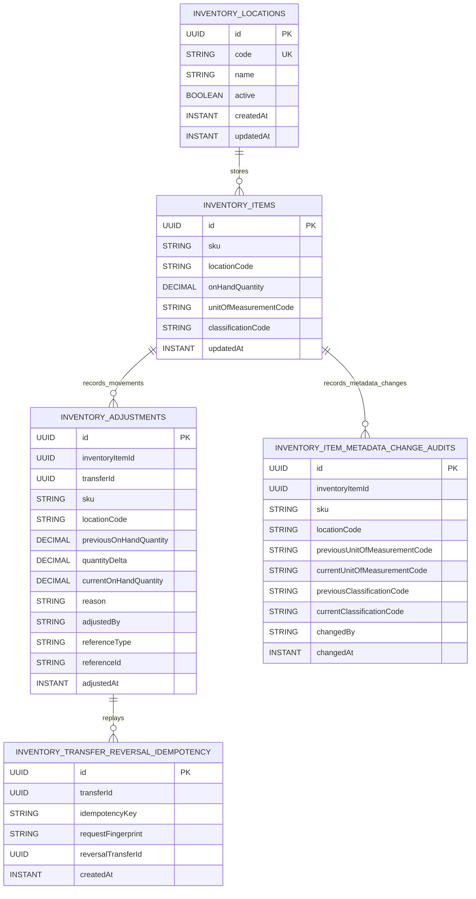

# Inventory Module Data Model (High-Level)

Updated: 2026-09-04

## Entity Diagram

```mermaid
erDiagram
    INVENTORY_LOCATIONS ||--o{ INVENTORY_ITEMS : stores
    INVENTORY_ITEMS ||--o{ INVENTORY_ADJUSTMENTS : records_movements
    INVENTORY_ITEMS ||--o{ INVENTORY_ITEM_METADATA_CHANGE_AUDITS : records_metadata_changes
    INVENTORY_ADJUSTMENTS ||--o{ INVENTORY_TRANSFER_REVERSAL_IDEMPOTENCY : replays

    INVENTORY_LOCATIONS {
      UUID id PK
      STRING code UK
      STRING name
      BOOLEAN active
      INSTANT createdAt
      INSTANT updatedAt
    }

    INVENTORY_ITEMS {
      UUID id PK
      STRING sku
      STRING locationCode
      DECIMAL onHandQuantity
      STRING unitOfMeasurementCode
      STRING classificationCode
      INSTANT updatedAt
    }

    INVENTORY_ADJUSTMENTS {
      UUID id PK
      UUID inventoryItemId
      UUID transferId
      STRING sku
      STRING locationCode
      DECIMAL previousOnHandQuantity
      DECIMAL quantityDelta
      DECIMAL currentOnHandQuantity
      STRING reason
      STRING adjustedBy
      STRING referenceType
      STRING referenceId
      INSTANT adjustedAt
    }

    INVENTORY_ITEM_METADATA_CHANGE_AUDITS {
      UUID id PK
      UUID inventoryItemId
      STRING sku
      STRING locationCode
      STRING previousUnitOfMeasurementCode
      STRING currentUnitOfMeasurementCode
      STRING previousClassificationCode
      STRING currentClassificationCode
      STRING changedBy
      INSTANT changedAt
    }

    INVENTORY_TRANSFER_REVERSAL_IDEMPOTENCY {
      UUID id PK
      UUID transferId
      STRING idempotencyKey
      STRING requestFingerprint
      UUID reversalTransferId
      INSTANT createdAt
    }
```

## Relationship Notes

- Inventory on-hand is segmented by `sku + locationCode`.
- Inventory item metadata carries `unitOfMeasurementCode` and `classificationCode` for legacy inventory-entry parity.
- Inventory item `unitOfMeasurementCode` values are validated against the core UOM catalog at item registration and metadata update boundaries.
- `inventory_items.locationCode` aligns with `inventory_locations.code` (code-based location reference).
- `inventory_adjustments.inventoryItemId` is a logical reference to `inventory_items.id`.
- `inventory_item_metadata_change_audits.inventoryItemId` is a logical reference to `inventory_items.id`.
- Inventory changes are append-only via `inventory_adjustments`; `inventory_items.onHandQuantity` stores latest per-location state.
- Inventory item metadata changes are append-only via `inventory_item_metadata_change_audits`.
- Location transfers write two adjustment rows with a shared `transferId` (source negative delta, destination positive delta).
- Destination stock rows created by transfers copy the source item's UOM and classification metadata.
- Transfer rows can optionally carry source-document metadata (`referenceType`, `referenceId`) for parity traceability.
- Transfer reversals are modeled as new transfer pairs where `referenceType = TRANSFER_REVERSAL` and `referenceId = <originalTransferId>`.
- Reversal idempotency keys are tracked in `inventory_transfer_reversal_idempotency` for replay-safe reversal retries.
- `requestFingerprint` stores a stable hash of normalized reversal request body fields to reject same-key reuse with divergent payloads.
- `(transferId, idempotencyKey)` uniqueness is also used as a write-claim to prevent duplicate reversal creation under concurrent same-key requests.
- Pending idempotency claims are treated as stale after 5 minutes by default; this is configurable via `arcanaerp.inventory.reversal-idempotency.pending-claim-ttl`.

## Constraint Notes

- Unique constraints:
  - `inventory_locations(code)`
  - `inventory_items(sku, locationCode)`
  - `inventory_transfer_reversal_idempotency(transferId, idempotencyKey)`
- Indexes:
  - `inventory_adjustments(inventoryItemId, adjustedAt)`
  - `inventory_adjustments(inventoryItemId, adjustedBy, adjustedAt)`
  - `inventory_adjustments(transferId)`
  - `inventory_adjustments(sku, referenceType, referenceId, adjustedAt)`
  - `inventory_item_metadata_change_audits(inventoryItemId, changedAt)`
  - `inventory_item_metadata_change_audits(sku, locationCode, changedAt)`
  - `inventory_transfer_reversal_idempotency(reversalTransferId)`

## Minimal HTTP Surface

- `POST /api/inventory/locations`
- `GET /api/inventory/locations/{code}`
- `PATCH /api/inventory/locations/{code}/active`
- `GET /api/inventory/locations?page=&size=&active=`
- `POST /api/inventory/items`
- `GET /api/inventory/items?page=&size=&sku=&locationCode=&unitOfMeasurementCode=&classificationCode=`
- `GET /api/inventory/items/{sku}/locations/{locationCode}`
- `PATCH /api/inventory/items/{sku}/locations/{locationCode}/metadata`
- `GET /api/inventory/items/{sku}/locations/{locationCode}/metadata-history?page=&size=&changedBy=&changedAtFrom=&changedAtTo=`
- `GET /api/inventory/{sku}?locationCode=` (`locationCode` defaults to `MAIN`)
- `GET /api/inventory/{sku}/adjustments?page=&size=&locationCode=&adjustedBy=&adjustedAtFrom=&adjustedAtTo=` (`locationCode` defaults to `MAIN`)
- `POST /api/inventory/{sku}/adjustments?locationCode=` (`locationCode` defaults to `MAIN`)
- `POST /api/inventory/{sku}/transfers`
- `GET /api/inventory/transfers/{transferId}`
- `POST /api/inventory/transfers/{transferId}/reversals` (optional `Idempotency-Key` header for retry-safe replay; reusing a key with a different payload returns `409 Conflict`; concurrent first-write requests with the same key return `409 Conflict`; stale pending claims are automatically reclaimed after 5 minutes on retry)
- `GET /api/inventory/transfers/{transferId}/reversals?page=&size=`
- `GET /api/inventory/{sku}/transfers?page=&size=&sourceLocationCode=&destinationLocationCode=&adjustedBy=&referenceType=&referenceId=&adjustedAtFrom=&adjustedAtTo=`
- `GET /api/inventory/{sku}/transfer-activity/daily-summary?page=&size=&sourceLocationCode=&destinationLocationCode=&adjustedBy=&referenceType=&referenceId=&adjustedAtFrom=&adjustedAtTo=`
- `GET /api/inventory/{sku}/transfer-activity/daily-summary/by-reference?page=&size=&sourceLocationCode=&destinationLocationCode=&adjustedBy=&referenceType=&referenceId=&adjustedAtFrom=&adjustedAtTo=`
- `GET /api/inventory/{sku}/transfer-activity/weekly-summary?page=&size=&sourceLocationCode=&destinationLocationCode=&adjustedBy=&referenceType=&referenceId=&adjustedAtFrom=&adjustedAtTo=`
- `GET /api/inventory/{sku}/transfer-activity/weekly-summary/by-reference?page=&size=&sourceLocationCode=&destinationLocationCode=&adjustedBy=&referenceType=&referenceId=&adjustedAtFrom=&adjustedAtTo=`
- `GET /api/inventory/{sku}/transfer-activity/monthly-summary?page=&size=&sourceLocationCode=&destinationLocationCode=&adjustedBy=&referenceType=&referenceId=&adjustedAtFrom=&adjustedAtTo=`
- `GET /api/inventory/{sku}/transfer-activity/monthly-summary/by-reference?page=&size=&sourceLocationCode=&destinationLocationCode=&adjustedBy=&referenceType=&referenceId=&adjustedAtFrom=&adjustedAtTo=`
- `GET /api/inventory/{sku}/adjustment-activity/daily-summary?page=&size=&locationCode=&adjustedBy=&adjustedAtFrom=&adjustedAtTo=` (`locationCode` defaults to `MAIN`)
- `GET /api/inventory/{sku}/adjustment-activity/daily-summary/by-location?page=&size=&locationCode=&adjustedBy=&adjustedAtFrom=&adjustedAtTo=`
- `GET /api/inventory/{sku}/adjustment-activity/daily-summary/by-adjusted-by?page=&size=&locationCode=&adjustedBy=&adjustedAtFrom=&adjustedAtTo=`
- `GET /api/inventory/{sku}/adjustment-activity/weekly-summary?page=&size=&locationCode=&adjustedBy=&adjustedAtFrom=&adjustedAtTo=` (`locationCode` defaults to `MAIN`)
- `GET /api/inventory/{sku}/adjustment-activity/weekly-summary/by-location?page=&size=&locationCode=&adjustedBy=&adjustedAtFrom=&adjustedAtTo=`
- `GET /api/inventory/{sku}/adjustment-activity/weekly-summary/by-adjusted-by?page=&size=&locationCode=&adjustedBy=&adjustedAtFrom=&adjustedAtTo=`
- `GET /api/inventory/{sku}/adjustment-activity/monthly-summary?page=&size=&locationCode=&adjustedBy=&adjustedAtFrom=&adjustedAtTo=` (`locationCode` defaults to `MAIN`)
- `GET /api/inventory/{sku}/adjustment-activity/monthly-summary/by-location?page=&size=&locationCode=&adjustedBy=&adjustedAtFrom=&adjustedAtTo=`
- `GET /api/inventory/{sku}/adjustment-activity/monthly-summary/by-adjusted-by?page=&size=&locationCode=&adjustedBy=&adjustedAtFrom=&adjustedAtTo=`

## Query Notes

- inventory location codes are normalized to uppercase at write and lookup boundaries
- inactive inventory locations remain readable but reject new adjustment and transfer writes
- inventory item UOM and classification codes default to `EA` and `ON_HAND` when not explicitly supplied
- supplied and default inventory item UOM codes must exist in the core unit-of-measurement catalog
- inventory item list filters match normalized `sku`, `locationCode`, `unitOfMeasurementCode`, and `classificationCode` values
- inventory item metadata updates preserve on-hand quantity, require `changedBy`, reject no-op changes, and append audit rows
- inventory item metadata history filters match lowercase `changedBy` and inclusive UTC `changedAt` ranges
- adjustment activity summaries bucket append-only `inventory_adjustments` rows by UTC `adjustedAt`
- weekly adjustment activity summaries use Monday as the business week start
- adjustment activity rows include `adjustmentCount` and `netQuantityDelta` for the requested `sku + locationCode`
- by-location adjustment activity rows scan all locations for the requested SKU unless `locationCode` is supplied
- transfer activity summaries bucket paired transfer rows by UTC `adjustedAt`, source location, destination location, and `adjustedBy`
- by-reference transfer activity summaries bucket paired transfer rows by UTC `adjustedAt`, `referenceType`, and `referenceId`
- transfer activity rows include `transferCount` and `totalQuantity`; weekly transfer summaries use Monday as the business week start
