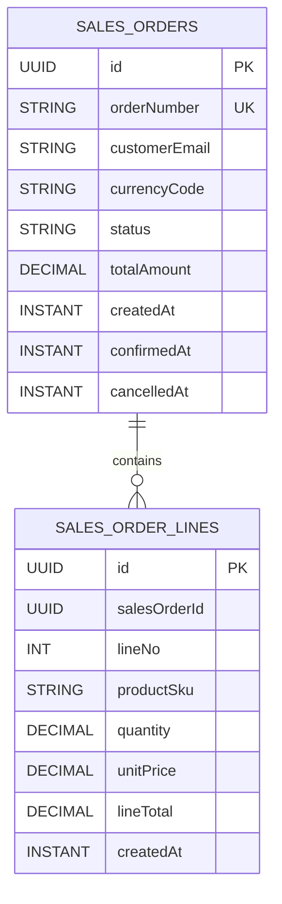

# Orders Module Data Model (High-Level)

Updated: 2026-03-01

## Entity Diagram

## Relationship Notes

- `sales_order_lines.salesOrderId` is a logical reference to `sales_orders.id`.
- The relationship is modeled as an explicit ID link (no bidirectional JPA mapping).
- `SalesOrder.status` is persisted as a string enum (`DRAFT`, `CONFIRMED`, `CANCELLED`).

## Constraint and Index Notes

- Unique constraints:
  - `sales_orders(orderNumber)`
  - `sales_order_lines(salesOrderId, lineNo)`
- Indexes:
  - `sales_order_lines(salesOrderId)`
