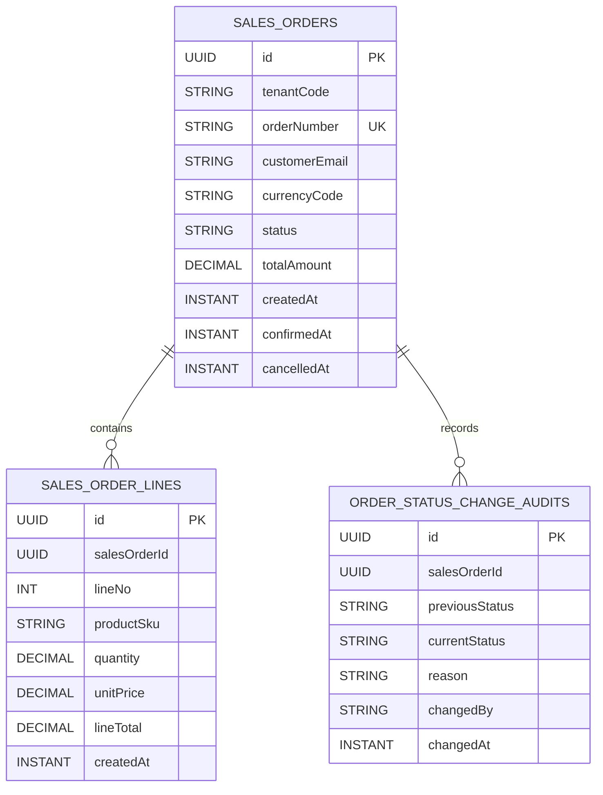

# Orders Module Data Model (High-Level)

Updated: 2026-03-01

## Entity Diagram

```mermaid
erDiagram
    SALES_ORDERS ||--o{ SALES_ORDER_LINES : contains
    SALES_ORDERS ||--o{ ORDER_STATUS_CHANGE_AUDITS : records

    SALES_ORDERS {
      UUID id PK
      STRING tenantCode
      STRING orderNumber UK
      STRING customerEmail
      STRING currencyCode
      STRING status
      DECIMAL totalAmount
      INSTANT createdAt
      INSTANT confirmedAt
      INSTANT cancelledAt
    }

    SALES_ORDER_LINES {
      UUID id PK
      UUID salesOrderId
      INT lineNo
      STRING productSku
      DECIMAL quantity
      DECIMAL unitPrice
      DECIMAL lineTotal
      INSTANT createdAt
    }

    ORDER_STATUS_CHANGE_AUDITS {
      UUID id PK
      UUID salesOrderId
      STRING previousStatus
      STRING currentStatus
      STRING reason
      STRING changedBy
      INSTANT changedAt
    }
```

## Relationship Notes

- `sales_order_lines.salesOrderId` is a logical reference to `sales_orders.id`.
- `order_status_change_audits.salesOrderId` is a logical reference to `sales_orders.id`.
- The relationship is modeled as an explicit ID link (no bidirectional JPA mapping).
- `SalesOrder.tenantCode` is normalized to uppercase and currently scopes list queries.
- `SalesOrder.status` is persisted as a string enum (`DRAFT`, `CONFIRMED`, `CANCELLED`).
- Order status-change audits capture normalized `changedBy` actor email and a free-form reason.

## Constraint and Index Notes

- Unique constraints:
  - `sales_orders(orderNumber)` remains globally unique during this early iteration so invoicing can keep using order-number lookup compatibility.
  - `sales_order_lines(salesOrderId, lineNo)`
- Indexes:
  - `sales_order_lines(salesOrderId)`
  - `order_status_change_audits(salesOrderId, changedAt)`
  - `order_status_change_audits(salesOrderId, currentStatus, changedAt)`

## Minimal HTTP Surface

- `POST /api/orders`
- `GET /api/orders/{orderNumber}`
- `GET /api/orders?page=&size=&tenantCode=`
- `PATCH /api/orders/{orderNumber}/status` (request includes `status`, `reason`, `changedBy`)
- `GET /api/orders/{orderNumber}/status-history?page=&size=&previousStatus=&currentStatus=&changedBy=&changedAtFrom=&changedAtTo=`
- `GET /api/orders/status-activity/daily-summary?page=&size=&previousStatus=&currentStatus=&changedBy=&changedAtFrom=&changedAtTo=`
- `GET /api/orders/status-activity/weekly-summary?page=&size=&previousStatus=&currentStatus=&changedBy=&changedAtFrom=&changedAtTo=`
- `GET /api/orders/status-activity/monthly-summary?page=&size=&previousStatus=&currentStatus=&changedBy=&changedAtFrom=&changedAtTo=`

## Query Notes

- status-history results are sorted by `changedAt DESC`
- order listing supports an optional `tenantCode` filter
- status-history supports optional `previousStatus`, `currentStatus`, `changedBy`, `changedAtFrom`, and `changedAtTo` filters
- status-history ranges require `changedAtFrom <= changedAtTo`
- status-activity summaries use UTC daily, Monday-start weekly, and calendar-month buckets
- status-activity summaries support the same optional audit filters and return transition counts plus distinct order counts
