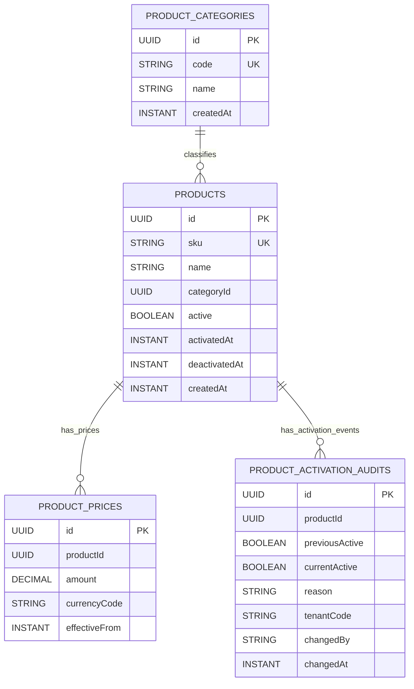

# Products Module Data Model (High-Level)

Updated: 2026-03-01

## Entity Diagram

## Relationship Notes

- `products.categoryId` is a logical reference to `product_categories.id` (explicit ID link, no bidirectional JPA mapping).
- `product_prices.productId` is a logical reference to `products.id`.
- `product_activation_audits.productId` is a logical reference to `products.id`.

## Query and Index Notes

- `product_prices`: index on `(productId, effectiveFrom)` for latest price lookups.
- `product_activation_audits`: indexes on:
  - `(productId, changedAt)`
  - `(productId, currentActive, changedAt)`
  - `(productId, tenantCode, changedAt)`
  - `(productId, changedBy, changedAt)`
  - `(productId, tenantCode, changedBy, changedAt)`
